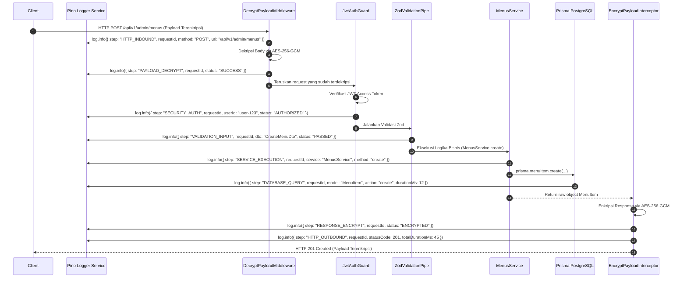

# Step-Tracing Logging Architecture Specification (Hybrid Transport)

> **Project**: MenuScan – Digital QR Code Menu System  
> **Target Scope**: Structured Step-by-Step Logging Pipeline across NestJS Architecture Layers  
> **Logging Framework**: `nestjs-pino` (Structured JSON + Pino Roll for File Rotation)  
> **Log Transport Strategy**: Opsi B (Hybrid Transport: Console/stdout + Optional File Logging)  
> **Document Location**: `docs/architecture/logging-strategy.md`  

---

## 🎯 1. Filosofi & Tujuan Step-Tracing Logging

Untuk memastikan visibilitas penuh (*end-to-end observability*) dan kemudahan *debugging* pada sistem yang menerapkan **Payload Encryption** dan **Otentikasi JWT**, log tidak hanya dicatat secara acak. 

Setiap baris log **wajib memiliki tag `step` (tahapan eksekusi)** dan **`requestId` (UUID unik)**. Dengan ini, pengembang atau devops dapat dengan cepat melihat perjalanan sebuah request berpindah dari satu layer ke layer lainnya:

```text
[HTTP_INBOUND] ──► [PAYLOAD_DECRYPT] ──► [SECURITY_AUTH] ──► [VALIDATION_INPUT] ──► [SERVICE_EXECUTION] ──► [DATABASE_QUERY] ──► [RESPONSE_ENCRYPT] ──► [HTTP_OUTBOUND]
```

---

## 🌲 2. Strategi Log Transport: Opsi B (Hybrid Console + File Rotation)

Aplikasi mendukung dua target pengiriman log sekaligus (Hybrid Transport):

1. **Console / stdout (Wajib)**:
   - Mode Development: Ditampilkan secara rapi dan berwarna menggunakan `pino-pretty`.
   - Mode Production: Ditampilkan sebagai JSON stream terstruktur.
2. **File Rotation (Opsional via `.env`)**:
   - Jika `LOG_TO_FILE=true`, Pino menggunakan `pino-roll` untuk memutar (*rotate*) berkas log ke folder `./logs/` secara harian.
   - Rotasi harian membuat berkas log rapi: `logs/app-2026-08-06.log`.
   - File log tua yang melewati batas `LOG_RETENTION_DAYS` (default 14 hari) akan dibersihkan secara otomatis.

### Konfigurasi `.env`:
```env
LOG_TO_FILE=true
LOG_FILE_PATH="./logs"
LOG_RETENTION_DAYS=14
```

---

## 📊 3. Daftar Tahapan Standardized Step Tags

Seluruh log yang dihasilkan oleh aplikasi akan menyertakan field `"step": "<NAMA_STEP>"` sesuai dengan layer tempat kode berjalan:

| Step Tag | Layer / Komponen | Deskripsi Operasi | Contoh Metadata Log |
| :--- | :--- | :--- | :--- |
| **`HTTP_INBOUND`** | `DecryptionMiddleware` / Logger | Membuka koneksi HTTP Request baru dan menempelkan `requestId`. | `requestId`, `method`, `url`, `ip`, `userAgent` |
| **`PAYLOAD_DECRYPT`** | `DecryptPayloadMiddleware` | Memproses deskripsi payload AES-256-GCM dari Client. | `requestId`, `handshakeToken`, `status: "SUCCESS\|SKIPPED"` |
| **`SECURITY_AUTH`** | `JwtAuthGuard` / `HandshakeGuard` | Memverifikasi Access Token / Handshake Token. | `requestId`, `userId`, `route`, `status: "AUTHORIZED\|DENIED"` |
| **`VALIDATION_INPUT`** | `ZodValidationPipe` | Memvalidasi objek DTO yang sudah terdekripsi menggunakan Zod. | `requestId`, `dtoName`, `status: "PASSED\|FAILED"` |
| **`SERVICE_EXECUTION`** | Domain Service (misal `MenusService`) | Menjalankan logika bisnis domain. | `requestId`, `service`, `method`, `action` |
| **`DATABASE_QUERY`** | `PrismaService` (Extension/Middleware) | Mengukur durasi eksekusi query PostgreSQL via Prisma. | `requestId`, `model`, `action`, `durationMs` |
| **`RESPONSE_ENCRYPT`** | `EncryptPayloadInterceptor` | Mengenkripsi objek return controller menjadi ciphertext AES-256-GCM. | `requestId`, `status: "ENCRYPTED\|BYPASSED"` |
| **`HTTP_OUTBOUND`** | `LoggerInterceptor` | Mengirimkan HTTP Response ke client dan mencatat total waktu eksekusi. | `requestId`, `statusCode`, `totalDurationMs` |
| **`EXCEPTION_CATCH`** | `GlobalExceptionFilter` | Menangkap error/exception yang dilempar oleh aplikasi. | `requestId`, `exceptionClass`, `stackTrace`, `statusCode` |

---

## 🔄 4. Visual Alur Step-Tracing Sequence

Berikut visualisasi bagaimana sebuah HTTP Request tercatat langkah demi langkah (*step-by-step*) dari awal sampai akhir:



---

## 🔒 5. Keamanan & Proteksi Masking Data Sensitif

Untuk mematuhi aturan keamanan, `nestjs-pino` dikonfigurasi dengan aturan **Sensitive Data Redaction**.

### Field yang Wajib Di-Masking (Dipotong/Disamarkan):
```typescript
redact: [
  'req.headers.authorization',
  'req.headers["x-handshake-token"]',
  'body.password',
  'body.refreshToken',
  'body.accessToken',
  'body.payload',
  'body.iv',
  'body.tag',
  'body.clientPublicKey',
];
```

### Contoh Hasil Output Log JSON Terstruktur di Production:

#### 1. Inbound Request:
```json
{
  "level": 30,
  "time": 1785989900000,
  "requestId": "c8a4b6d0-5e3a-4a2b-8f1c-9d8e7f6a5b4c",
  "step": "HTTP_INBOUND",
  "method": "POST",
  "url": "/api/v1/admin/menus",
  "ip": "127.0.0.1",
  "msg": "Incoming HTTP Request"
}
```

#### 2. Database Query:
```json
{
  "level": 30,
  "time": 1785989900025,
  "requestId": "c8a4b6d0-5e3a-4a2b-8f1c-9d8e7f6a5b4c",
  "step": "DATABASE_QUERY",
  "model": "MenuItem",
  "action": "create",
  "durationMs": 14,
  "msg": "Prisma query executed successfully"
}
```

#### 3. Exception Catch (Jika Terjadi Error):
```json
{
  "level": 50,
  "time": 1785989900040,
  "requestId": "c8a4b6d0-5e3a-4a2b-8f1c-9d8e7f6a5b4c",
  "step": "EXCEPTION_CATCH",
  "statusCode": 400,
  "exceptionClass": "ZodValidationException",
  "error": "Bad Request",
  "details": [{ "field": "price", "message": "Price must be positive" }],
  "msg": "Zod validation failed for CreateMenuDto"
}
```

---

## 🛠️ 6. Slow Query Detection (Prisma Threshold)

Jika ada query PostgreSQL yang membutuhkan waktu **> 500ms**, `PrismaService` akan secara otomatis mencatat log bertipe **`WARN`**:

```json
{
  "level": 40,
  "time": 1785989900100,
  "requestId": "c8a4b6d0-5e3a-4a2b-8f1c-9d8e7f6a5b4c",
  "step": "DATABASE_QUERY",
  "model": "MenuItem",
  "action": "findMany",
  "durationMs": 620,
  "msg": "SLOW QUERY DETECTED: Prisma findMany took 620ms"
}
```

---

## 🔗 7. Terhubung ke Dokumen Terkait

- 📄 Arsitektur Utama Backend: [architecture-design.md](file:///d:/code/be-menu-scan-latihan/docs/architecture/architecture-design.md)
- 📄 Spesifikasi Enkripsi: [encryption-decryption-strategy.md](file:///d:/code/be-menu-scan-latihan/docs/security/encryption-decryption-strategy.md)
