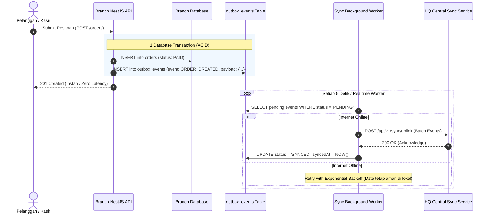

# SaaS Multi-Branch & Microservices Architecture Specification

> **Project**: MenuScan FnB Enterprise SaaS Platform  
> **Component**: Backend Core Architecture & Data Sync Engine  
> **Status**: MASTER ARCHITECTURE BLUEPRINT  
> **Backend Stack**: NestJS 11, PostgreSQL, Prisma ORM, WebCrypto Zero-Trust, Redis Streams / RabbitMQ  
> **Document Location**: `docs/be/architecture/saas-multi-branch-microservices.md`  

---

## 🏛️ 1. Master System Topology: Branch Engine vs HQ Master Hub

Sistem dirancang dengan arsitektur **Distributed Edge-Cloud Hybrid** yang memisahkan tanggung jawab antara **Aplikasi Cabang (Branch Engine)** dan **Aplikasi Induk (HQ SaaS SuperApp)**:

```mermaid
flowchart TD
    subgraph HQ Cloud SaaS (Induk / SuperAdmin)
        SSO[Central SSO & Auth Service<br/>auth.fnbapp.com]
        HQ_API[HQ Master Control API<br/>api.fnbapp.com]
        HQ_DB[(Master Central Database<br/>PostgreSQL Multi-Tenant)]
        SYNC_HUB[Sync Aggregator Worker<br/>Message Broker]
        
        SSO --> HQ_DB
        HQ_API --> HQ_DB
        SYNC_HUB --> HQ_DB
    end

    subgraph Branch 01 (Bandung Dipatiukur)
        B1_APP[Branch API Engine<br/>NestJS Local/Cloud]
        B1_DB[(Branch Database 01<br/>PostgreSQL / Edge DB)]
        B1_OUTBOX[Transactional Outbox Queue]
        
        B1_APP --> B1_DB
        B1_APP --> B1_OUTBOX
    end

    subgraph Branch 02 (Jakarta Senopati)
        B2_APP[Branch API Engine<br/>NestJS Local/Cloud]
        B2_DB[(Branch Database 02<br/>PostgreSQL / Edge DB)]
        B2_OUTBOX[Transactional Outbox Queue]
        
        B2_APP --> B2_DB
        B2_APP --> B2_OUTBOX
    end

    %% Sync Flows
    B1_OUTBOX -.->|Push Orders & Payments| SYNC_HUB
    B2_OUTBOX -.->|Push Orders & Payments| SYNC_HUB
    HQ_API -.->|Push Master Menus & Config| B1_APP
    HQ_API -.->|Push Master Menus & Config| B2_APP
```

---

## 🗄️ 2. Multi-DB Strategy: Branch Database vs Central DB

### A. Pembagian Tanggung Jawab Data (Authority Boundaries)

| Domain Data | Sumber Otoritas (Single Source of Truth) | Alur Replikasi / Sinkronisasi |
| :--- | :--- | :--- |
| **Identitas User & Akun** | **HQ Central DB (SSO)** | Didistribusikan ke Branch DB saat login/token issuance. |
| **Master Menu & Resep** | **HQ Central DB** | Didistribusikan (*Downlink Sync*) ke semua cabang. |
| **Stok & Availability Menu** | **Branch DB (Lokal)** | Lokal bisa override (*Out of Stock*), dilaporkan ke HQ. |
| **Denah Meja & Sesi Meja** | **Branch DB (Lokal)** | 100% lokal per cabang, tidak perlu sinkronisasi real-time ke HQ. |
| **Transaksi Pesanan (Orders)**| **Branch DB (Lokal)** | Dibuat instan di lokal, dikirim (*Uplink Sync*) ke HQ DB. |
| **Pembayaran & QRIS** | **Branch DB (Lokal)** | Diverifikasi lokal, dilaporkan ke HQ DB untuk rekonsiliasi keuangan. |

---

## 🔄 3. Bi-Directional Synchronization Engine (Transactional Outbox Pattern)

Untuk menjamin **Zero Data Loss** saat koneksi internet cabang terputus (*Offline-First*), sistem menggunakan **Transactional Outbox Pattern**:



---

## 🔐 4. Microservices Boundaries di Sisi HQ (Aplikasi Induk)

Saat SaaS Platform dipecah menjadi Microservices di sisi Backend Induk:

1. **Auth & SSO Service (`auth-service`)**:
   - Mengelola registrasi user, tenant billing status, OIDC/OAuth2 tokens, dan branch switching.
2. **Catalog & Menu Master Service (`catalog-service`)**:
   - Master item menu, harga dasar, kategori global, dan manajemen variasi template.
3. **Branch Sync & Ingestion Service (`sync-service`)**:
   - Menelan (*ingest*) jutaan event transaksi pesanan dari seluruh cabang secara asinkron via Message Broker.
4. **Consolidated Analytics & Financial Service (`analytics-service`)**:
   - Laporan omset gabungan, profit & loss, perbandingan performa antar cabang, analitik AI penjualan.
5. **Branch Fleet Manager (`fleet-service`)**:
   - Healthcheck status server cabang, monitoring versi engine cabang, dan remote backup.
