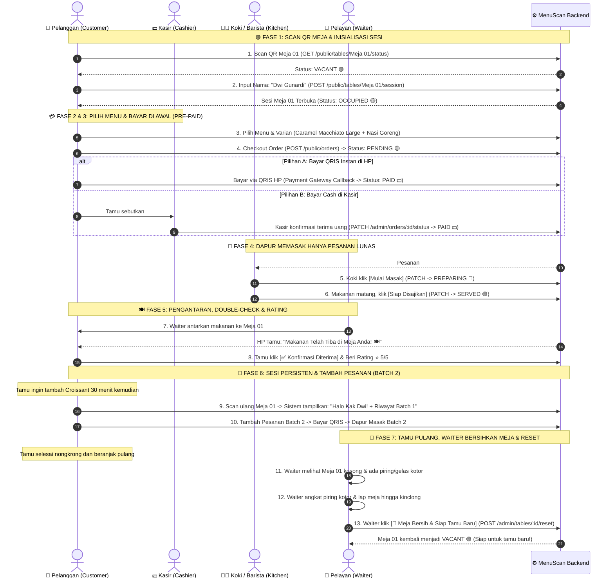
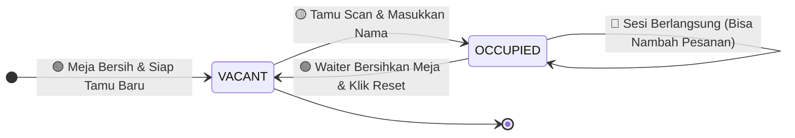
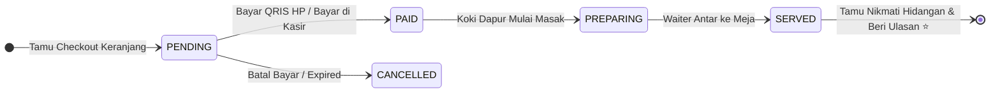

# ☕ MenuScan – Master Cafe Activity & Operational Flow Guide

> **Document Type**: Master End-to-End Activity Flow & Real-World Operational Blueprint (Pre-Paid / Pay-at-Order Model)  
> **Target Audience**: Product Owners, Frontend/Backend Developers, UI/UX Designers, Cafe Operations Staff  
> **Document Location**: `docs/flow/master-cafe-activity-flow.md`  
> **Status**: **Verified & Approved (Pre-Paid Model + Persistent Session + Waiter Cleanup)**

---

## 📑 Daftar Isi
1. [Prinsip & Visi Alur Pre-Paid (Pay-at-Order)](#1-prinsip--visi-alur-pre-paid-pay-at-order)
2. [Diagram Aktivitas Terintegrasi (Swimlane Activity Diagram)](#2-diagram-aktivitas-terintegrasi-swimlane-activity-diagram)
3. [Kronologi Cerita Operasional Nyata (Day in the Life of MenuScan)](#3-kronologi-cerita-operasional-nyata-day-in-the-life-of-menuscan)
   - [Fase 1: Kedatangan Pelanggan & Inisialisasi Sesi Meja](#fase-1-kedatangan-pelanggan--inisialisasi-sesi-meja)
   - [Fase 2: Pemilihan Menu, Variasi & Checkout Keranjang](#fase-2-pemilihan-menu-variasi--checkout-keranjang)
   - [Fase 3: Pembayaran di Awal (QRIS Online di HP vs Bayar Cash di Kasir)](#fase-3-pembayaran-di-awal-qris-online-di-hp-vs-bayar-cash-di-kasir)
   - [Fase 4: Dapur Memasak (Kitchen KDS) & Pengantaran Makanan (SERVED)](#fase-4-dapur-memasak-kitchen-kds--pengantaran-makanan-served)
   - [Fase 5: Double-Check & Splash Rating Bintang Pelanggan (⭐)](#fase-5-double-check--splash-rating-bintang-pelanggan-)
   - [Fase 6: Scan Ulang Sesi Meja Persisten & Tambah Pesanan (Batch 2)](#fase-6-scan-ulang-sesi-meja-persisten--tambah-pesanan-batch-2)
   - [Fase 7: Tamu Selesai Nongkrong, Waiter Pembersihan Meja & Reset (VACANT)](#fase-7-tamu-selesai-nongkrong-waiter-pembersihan-meja--reset-vacant)
4. [Tabel Hubungan: Aksi Fisik Nyata vs Respon Digital Backend](#4-tabel-hubungan-aksi-fisik-nyata-vs-respon-digital-backend)
5. [Penanganan Kasus Khusus (Edge Cases & Exception Handling)](#5-penanganan-kasus-khusus-edge-cases--exception-handling)
6. [Kamus Status Sistem (Table & Order State Lifecycle)](#6-kamus-status-sistem-table--order-state-lifecycle)

---

## 1. Prinsip & Visi Alur Pre-Paid (Pay-at-Order)

Sistem pemesanan cafe digital **MenuScan** mengadopsi model **Pre-Paid (Bayar di Awal)** yang umum digunakan pada cafe modern (*Starbucks, Fore, Kopi Kenangan*):

1. **Anti-Dine & Dash & Dapur Aman**: Dapur dan barista **hanya memasak pesanan yang sudah berstatus LUNAS (`PAID`)**. Tidak ada risiko makanan terbuang karena tamu kabur tanpa bayar.
2. **Fleksibilitas Pembayaran Multi-Channel**:
   - **Online Payment Langsung di HP**: Scan QRIS dinamis / E-Wallet / Virtual Account $\rightarrow$ Order otomatis `PAID` dan langsung masuk antrean masak dapur.
   - **Pay at Cashier**: Tamu membawa nomor order ke kasir $\rightarrow$ Bayar tunai/debit $\rightarrow$ Kasir konfirmasi `PAID` $\rightarrow$ Order masuk ke antrean dapur.
3. **Sesi Meja Persisten (Multi-Batch Orders)**: Tamu yang sedang nongkrong bisa scan ulang meja kapan saja untuk melihat riwayat pesanan yang sudah dibuat dan menambah pesanan baru (Batch 2, Batch 3) tanpa perlu memasukkan nama ulang.
4. **Zero Burden on Customer for Exit**: Tamu tidak dibebani tombol *"kosongkan meja"*. Saat tamu selesai dan pulang, Waiter yang melihat meja kosong akan membersihkan piring/gelas kotor dan melakukan 1-tap reset meja kembali menjadi `VACANT`.

---

## 2. Diagram Aktivitas Terintegrasi (Swimlane Activity Diagram)



---

## 3. Kronologi Cerita Operasional Nyata (Day in the Life of MenuScan)

Mari kita telusuri alur operasional cafe dari skenario nyata seorang tamu bernama **Dwi Gunardi** yang berkunjung ke Cafe MenuScan:

---

### Fase 1: Kedatangan Pelanggan & Inisialisasi Sesi Meja

```
  [🚶‍♂️ Tamu Masuk] ➔ [🪑 Duduk di Meja 01] ➔ [📷 Scan QR Code] ➔ [👤 Masukkan Nama Sekali]
```

1. **Aksi Fisik**: Dwi datang ke cafe dan memilih duduk di **Meja 01**.
2. **Aksi Digital**: Dwi membuka kamera smartphone dan scan stiker QR Code di meja (`https://menu.cafe.com/?table=Meja%2001`).
3. **Cek Status Meja**:
   - HP memanggil `GET /api/v1/public/tables/Meja%2001/status`.
   - Server mengembalikan `status: "VACANT"` (Meja kosong dan bersih).
4. **Buka Sesi Meja**:
   - Muncul modal: *"Selamat Datang! Masukkan nama Anda untuk memulai sesi meja."*
   - Dwi memasukkan nama: **"Dwi Gunardi"** $\rightarrow$ `POST /api/v1/public/tables/Meja%2001/session`.
   - **Hasil**: Meja 01 terkunci menjadi **`OCCUPIED`** atas nama Dwi Gunardi.

---

### Fase 2: Pemilihan Menu, Variasi & Checkout Keranjang

```
  [☕ Pilih Menu & Varian] ➔ [🛒 Keranjang Belanja] ➔ [⚡ Klik Lanjut ke Pembayaran]
```

1. **Kustomisasi Menu**:
   - Dwi memilih **Caramel Macchiato** (Promo: Rp 30.000) + Varian *Large (+6k)*, *Iced (+2k)*, *Extra Shot (+6k)* = **Rp 44.000**.
   - Dwi memilih **Nasi Goreng Spesial Cafe** (Rp 42.000, Level 2, Telur Dadar) = **Rp 42.000**.
2. **Review Keranjang**:
   - Total Belanja: $\text{Rp } 44.000 + \text{Rp } 42.000 = \text{Rp } 86.000$.
3. **Kirim Pesanan**:
   - Dwi menekan **`[Lanjut ke Pembayaran]`** $\rightarrow$ `POST /api/v1/public/orders`.
   - Server membuat pesanan **`#ORD-20260810-001`** dengan status awal **`PENDING` (Menunggu Pembayaran)**.

---

### Fase 3: Pembayaran di Awal (QRIS Online di HP vs Bayar Cash di Kasir)

```
  [💳 Pilih Pembayaran] ➔ [📱 Scan QRIS HP / 💵 Bayar di Kasir] ➔ [✅ Order LUNAS (PAID)]
```

Di layar HP Dwi muncul 2 pilihan metode pembayaran:

```
┌───────────────────────────────────────────────────────────┐
│            💳 PILIH METODE PEMBAYARAN                     │
├───────────────────────────────────────────────────────────┤
│                                                           │
│  🔘 PILIHAN A: BAYAR INSTAN DI HP (QRIS / E-Wallet)       │
│     • Scan QRIS otomatis di layar HP                      │
│     • Menggunakan GoPay, OVO, Dana, BCA Mobile, ShopeePay │
│     ➔ Begitu pembayaran terverifikasi, status pesanan     │
│       otomatis berubah menjadi PAID 💵!                   │
│                                                           │
│  🔘 PILIHAN B: BAYAR DI KASIR (Cash / Kartu Debit)        │
│     • HP menampilkan kode pesanan: #ORD-001               │
│     • Dwi berjalan ke kasir, bayar uang tunai Rp 86.000   │
│     • Kasir klik [Terima Pembayaran (PAID)] di POS        │
│                                                           │
└───────────────────────────────────────────────────────────┘
```

> [!IMPORTANT]
> **Prinsip Dapur**: Dapur **TIDAK AKAN MEMASAK** pesanan yang masih berstatus `PENDING`. Dapur baru mulai meracik hidangan saat pesanan sudah berstatus **`PAID`**.

---

### Fase 4: Dapur Memasak (Kitchen KDS) & Pengantaran Makanan (SERVED)

```
  [🔔 KDS Dapur Notifikasi] ➔ [🍳 Koki Masak (PREPARING)] ➔ [🍽️ Waiter Antar (SERVED)]
```

1. **Pesanan Masuk ke KDS Dapur**:
   - Begitu status pesanan `#ORD-001` menjadi **`PAID`**, kartu pesanan langsung muncul di kolom **`[🟡 PESANAN MASUK / PAID]`** pada tablet dapur.
   - Kartu menampilkan detail: *Meja 01 (Dwi Gunardi) • 1x Caramel Macchiato (Large, Iced, Extra Shot) • 1x Nasi Goreng (Lv 2, Telur Dadar)*.
2. **Koki Mulai Memasak**:
   - Koki menekan **`[▶️ Mulai Masak]`** $\rightarrow$ `PATCH /admin/orders/:id/status` status menjadi **`PREPARING`**.
   - Timer durasi memasak berjalan di layar dapur.
3. **Makanan Selesai & Diantar**:
   - Koki menaruh hidangan di nampan dan klik **`[🍽️ Siap Saji]`** $\rightarrow$ Status menjadi **`SERVED`**.
   - Waiter mengambil nampan dan mengantarkannya langsung ke **Meja 01**.

---

### Fase 5: Double-Check & Splash Rating Bintang Pelanggan (⭐)

```
  [📱 HP Tamu: "Makanan Tiba"] ➔ [✅ Klik Konfirmasi Diterima] ➔ [⭐ Splash Ulasan Rating]
```

1. **Konfirmasi Fisik Tamu**:
   - Layar smartphone Dwi otomatis berubah:  
     **"Hidangan Anda Telah Tiba di Meja! Silakan Periksa Pesanan Anda 🍽️"**.
   - Dwi memeriksa hidangannya dan menekan tombol **`[✅ Konfirmasi Pesanan Diterima]`**.
2. **Modal Splash Rating**:
   - Langsung muncul kartu ulasan bintang di layar HP Dwi:
     - ☕ *Caramel Macchiato*: [ ⭐ ⭐ ⭐ ⭐ ⭐ ] (5/5).
     - 🍛 *Nasi Goreng Spesial Cafe*: [ ⭐ ⭐ ⭐ ⭐ ⭐ ] (5/5).
     - Komentar: *"Kopi mantap, pelayanan cepat!"*.
   - Dwi menekan **`[Kirim Ulasan]`** $\rightarrow$ Rata-rata rating menu di katalog terupdate otomatis.

---

### Fase 6: Scan Ulang Sesi Meja Persisten & Tambah Pesanan (Batch 2)

```
  [☕ 30 Menit Kemudian] ➔ [📷 Scan QR Meja 01 Lagi] ➔ [📜 Tampil Riwayat Batch 1] ➔ [➕ Tambah Pesanan]
```

1. **Kondisi**: Tiga puluh menit kemudian, Dwi ingin menambah camilan penutup (*French Butter Croissant*).
2. **Scan Ulang Meja 01**:
   - Dwi scan ulang QR code Meja 01.
   - **Respon Cerdas Sistem**:
     - Sistem **TIDAK** meminta Dwi menginput nama ulang!
     - Sistem mengenali Meja 01 sedang aktif atas nama **Dwi Gunardi**.
     - HP menampilkan:
       - 👤 *"Halo Kak Dwi Gunardi! (Meja 01)"*
       - 📜 **Riwayat Pesanan**: Batch 1 (#ORD-001) - *Caramel Macchiato & Nasi Goreng [LUNAS & DISAJIKAN]*
       - ➕ **Tombol**: **`[➕ Tambah Pesanan Baru]`**
3. **Pemesanan Batch 2**:
   - Dwi klik Tambah Pesanan $\rightarrow$ Pilih *Butter Croissant (Rp 25.000)* $\rightarrow$ Bayar QRIS Rp 25.000 $\rightarrow$ Order `#ORD-002` (Batch 2) terbuat $\rightarrow$ Dapur memasak Batch 2.

---

### Fase 7: Tamu Selesai Nongkrong, Waiter Pembersihan Meja & Reset (VACANT)

```
  [🚶‍♂️ Tamu Pulang Tanpa Beban] ➔ [🧹 Waiter Angkat Piring] ➔ [🧽 Lap Meja] ➔ [📱 Waiter Reset Meja] ➔ [🟢 Meja VACANT]
```

1. **Tamu Pulang Tanpa Repot**:
   - Karena semua pesanan sudah dibayar lunas di awal (Pre-Paid), Dwi cukup berdiri dan berpamitan pulang tanpa perlu mengantre ke kasir lagi.
2. **Aksi Fisik Pelayan (Bussing Table)**:
   - Waiter melihat tamu Meja 01 sudah beranjak pergi dan ada piring/gelas kosong di meja.
   - Waiter mendatangi Meja 01, mengangkat piring kotor, dan mengelap meja hingga bersih dan rapi.
3. **1-Tap Reset Meja**:
   - Di smartphone Waiter, pelayan membuka menu **Floor Plan** dan tap tombol **`[🧹 Meja Selesai Dibersihkan]`** pada Meja 01.
   - HP Waiter memanggil `POST /api/v1/admin/tables/:id/reset`.
   - **Hasil**: Status Meja 01 kembali menjadi **`VACANT` 🟢** dan sesi Dwi selesai secara bersih.
   - Meja 01 siap menyambut tamu baru berikutnya!

---

## 4. Tabel Hubungan: Aksi Fisik Nyata vs Respon Digital Backend

| Tahapan | Aksi Fisik di Cafe | Aksi Sistem / Endpoint Backend | Status Meja | Status Order |
| :--- | :--- | :--- | :---: | :---: |
| **1. Scan Meja** | Tamu duduk & scan QR meja | `GET /public/tables/:number/status` | `VACANT` | - |
| **2. Buka Sesi** | Tamu input nama pemesan | `POST /public/tables/:number/session` | `OCCUPIED` | - |
| **3. Checkout** | Tamu klik bayar pesanan | `POST /public/orders` | `OCCUPIED` | `PENDING` |
| **4. Bayar Lunas** | Tamu bayar via QRIS HP / Kasir | Payment Callback / `PATCH :id/status` | `OCCUPIED` | `PAID` |
| **5. Dapur Masak** | Koki mulai memasak pesanan lunas | `PATCH :id/status` (`PREPARING`) | `OCCUPIED` | `PREPARING` |
| **6. Antar Meja** | Waiter antar makanan ke meja | `PATCH :id/status` (`SERVED`) | `OCCUPIED` | `SERVED` |
| **7. Rating** | Tamu konfirmasi & beri ulasan | Submit Rating Ulasan Menu | `OCCUPIED` | `SERVED` |
| **8. Tambah Menu** | Tamu scan ulang & nambah Batch 2 | `POST /public/orders` (Batch 2) | `OCCUPIED` | `PAID` (Batch 2) |
| **9. Tamu Pulang** | Tamu pulang langsung (Pre-Paid) | - | `OCCUPIED` | `SERVED` (All) |
| **10. Lap Meja** | Waiter angkat piring & lap meja | `POST /admin/tables/:id/reset` | `VACANT` | Archived |

---

## 5. Penanganan Kasus Khusus (Edge Cases & Exception Handling)

### 1. Teman Satu Meja Datang Menyusul (Join Table)
- **Kondisi**: Teman Dwi datang 15 menit kemudian dan scan QR Meja 01.
- **Respon Sistem**: HP teman langsung menampilkan: *"Meja 01 saat ini aktif digunakan oleh Dwi Gunardi. [Lihat Menu & Tambah Pesanan]"*. Teman bisa langsung checkout Batch 2 dan bayar sendiri via QRIS.

### 2. Pembayaran Kasir Tertunda (Tamu Lupa Bayar di Kasir)
- **Kondisi**: Tamu memilih opsi "Bayar di Kasir", tapi belum berjalan ke kasir untuk bayar.
- **Respon Sistem**: Order berstatus `PENDING`. Dapur **tidak akan memasak** sampai Kasir menekan konfirmasi `PAID`.

### 3. Menu Tiba-tiba Habis Saat Jam Sibuk
- **Kondisi**: Stok susu oat habis.
- **Respon Sistem**: Koki membuka tablet KDS dan menekan switch toggle `isAvailable: false` pada Matcha Oat Latte. Menu langsung berlabel **"Habis"** di seluruh HP pelanggan secara seketika.

---

## 6. Kamus Status Sistem (Table & Order State Lifecycle)

### A. Siklus Status Meja (`TableStatus`)


---

### B. Siklus Status Pesanan Pre-Paid (`OrderStatus`)

