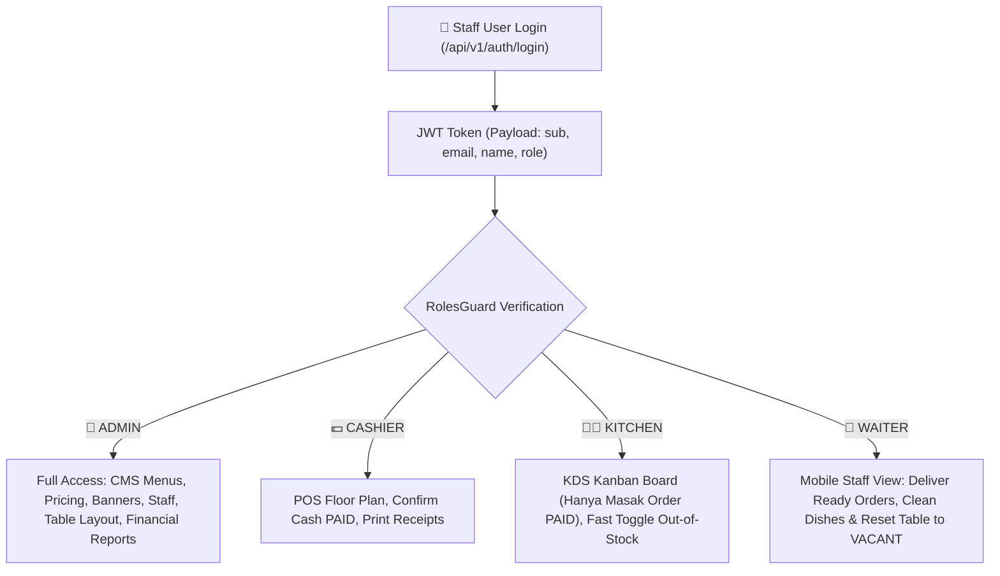
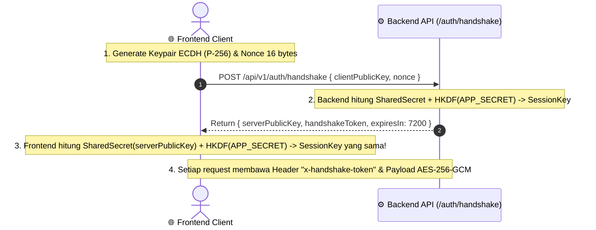
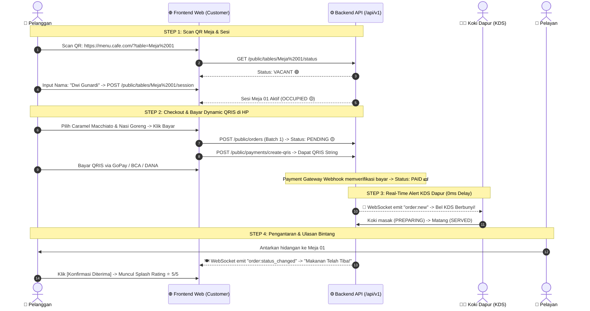
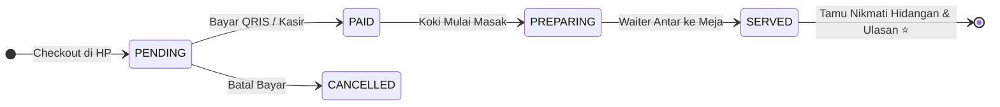
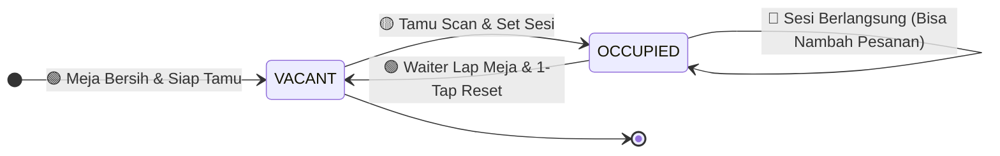

# 📱 MenuScan – Master Frontend Integration & Application Architecture Guide

> **Target Audience**: Frontend Engineers (React, Next.js, Vue, Flutter, Web / PWA), UI/UX Designers, Product Managers  
> **Backend Architecture**: NestJS 11 + PostgreSQL + Prisma ORM + Redis Cache + WebSockets (Socket.IO) + Multi-Role RBAC  
> **Ordering Model**: **Pre-Paid (Bayar di Awal / Pay-at-Order) + Persistent Multi-Batch Session**  
> **Architecture Pattern**: **Either / Result Pattern (Railway-Oriented) + Double-Sided Zod Contract Hardening**  
> **Security Protocol**: **ECDH P-256 Handshake + AES-256-GCM + Pre-Shared Hardcoded Salt (`APP_SECRET`)**  
> **API Base URL**: `http://localhost:5000/api/v1`  
> **WebSocket Gateway URL**: `ws://localhost:5000/events` (Socket.IO)  
> **Interactive Swagger OpenAPI**: `http://localhost:5000/api/docs`  
> **Status**: **Production Ready & Complete (Phases 0–5 Verified)**

---

## 📑 Daftar Isi

1. [Executive Summary & Pre-Paid Model Concept](#1-executive-summary--pre-paid-model-concept)
2. [Arsitektur RBAC & 4 Peran Staff (Role-Based Access Control)](#2-arsitektur-rbac--4-peran-staff-role-based-access-control)
3. [Arsitektur Frontend Hardening & Either / Result Pattern (1 Jalur Terpusat)](#3-arsitektur-frontend-hardening--either--result-pattern-1-jalur-terpusat)
   - [A. Prinsip Railway-Oriented Programming (Left vs Right)](#a-prinsip-railway-oriented-programming-left-vs-right)
   - [B. Template File Types & Kontrak Error (`types/api.ts`)](#b-template-file-types--kontrak-error-typesapits)
   - [C. Template Single Gateway Client (`lib/api-client.ts`)](#c-template-single-gateway-client-libapi-clientts)
   - [D. Template Skema Kontrak Zod (`schemas/menu.schema.ts`, `order.schema.ts`)](#d-template-skema-kontrak-zod-schemasmenuschemats-orderschemats)
   - [E. Contoh Pemakaian di Komponen UI / Hook React / Next.js](#e-contoh-pemakaian-di-komponen-ui--hook-react--nextjs)
4. [Arsitektur Payload Encryption, ECDH Handshake & Hardcoded Secret (`APP_SECRET`)](#4-arsitektur-payload-encryption-ecdh-handshake--hardcoded-secret-app_secret)
   - [A. Konsep Peran Hardcoded Pre-Shared Salt (`APP_SECRET`)](#a-konsep-peran-hardcoded-pre-shared-salt-app_secret)
   - [B. Alur 4 Langkah Handshake Kriptografi](#b-alur-4-langkah-handshake-kriptografi)
   - [C. Template Kode Lengkap Kriptografi Frontend (`lib/crypto/ecdh.ts`)](#c-template-kode-lengkap-kriptografi-frontend-libcryptoecdhts)
5. [Alur Bisnis & User Journey Terpadu (Pre-Paid Flow)](#5-alur-bisnis--user-journey-terpadu-pre-paid-flow)
   - [A. Customer Journey (Scan Meja $\rightarrow$ Pre-Paid $\rightarrow$ Rating $\rightarrow$ Tambah Pesanan)](#a-customer-journey-scan-meja--pre-paid--rating--tambah-pesanan)
   - [B. Kitchen KDS Journey (Hanya Masak Pesanan yang Sudah LUNAS / PAID)](#b-kitchen-kds-journey-hanya-masak-pesanan-yang-sudah-lunas--paid)
   - [C. Cashier POS Journey (Konfirmasi Bayar Cash / EDC)](#c-cashier-pos-journey-konfirmasi-bayar-cash--edc)
   - [D. Waiter Mobile Journey (Pengantaran Makanan & 1-Tap Reset Meja)](#d-waiter-mobile-journey-pengantaran-makanan--1-tap-reset-meja)
6. [Integrasi Real-Time WebSockets (Socket.IO)](#6-integrasi-real-time-websockets-socketio)
   - [A. Cara Connect ke WebSocket Gateway](#a-cara-connect-ke-websocket-gateway)
   - [B. Room Subscriptions & Event Catalog](#b-room-subscriptions--event-catalog)
7. [Pemetaan Layar Frontend (Screen-by-Screen UI Blueprints)](#7-pemetaan-layar-frontend-screen-by-screen-ui-blueprints)
   - [A. Customer Mobile Web App (Screens 1 – 6)](#a-customer-mobile-web-app-screens-1--6)
   - [B. Proper Admin & Staff Dashboard Suite (Screens A – E)](#b-proper-admin--staff-dashboard-suite-screens-a--e)
8. [Spesifikasi Teknis Integrasi API & Backend Hardening](#8-spesifikasi-teknis-integrasi-api--backend-hardening)
   - [A. Standard Envelope Response Format](#a-standard-envelope-response-format)
   - [B. Sesi Meja Persisten & Struktur Active Orders](#b-sesi-meja-persisten--struktur-active-orders)
   - [C. Logika Perhitungan Harga Varian di Frontend (Cart Formula)](#c-logika-perhitungan-harga-varian-di-frontend-cart-formula)
   - [D. State Machine Siklus Hidup Pesanan & Meja](#d-state-machine-siklus-hidup-pesanan--meja)
   - [E. Backend Response Hardening dengan `@ZodResponse`](#e-backend-response-hardening-dengan-zodresponse)
9. [Katalog Endpoint & Contoh Payload Lengkap](#9-katalog-endpoint--contoh-payload-lengkap)
   - [1. Default Credentials untuk Testing 4 Role Staff](#1-default-credentials-untuk-testing-4-role-staff)
   - [2. Modul Public (Customer, QRIS & Tracking)](#2-modul-public-customer-qris--tracking)
   - [3. Modul Auth & Staff Profile](#3-modul-auth--staff-profile)
   - [4. Modul Admin & Staff Operations (KDS, Floor Plan, Menu)](#4-modul-admin--staff-operations-kds-floor-plan-menu)
   - [5. Modul Executive Dashboard Overview & Financial Reports](#5-modul-executive-dashboard-overview--financial-reports)

---

## 1. Executive Summary & Pre-Paid Model Concept

**MenuScan** mengadopsi model **Pre-Paid (Bayar di Awal)** yang umum digunakan pada cafe modern (*Starbucks, Fore, Kopi Kenangan*):

1. **Anti-Dine & Dash & Dapur Aman**: Dapur dan barista **hanya memasak pesanan yang sudah berstatus LUNAS (`PAID`)**.
2. **Real-Time Synchronized**: Menggunakan **WebSockets (Socket.IO)** sehingga pesanan baru langsung memicu bel alarm di KDS dapur dengan **0ms delay**, dan layar HP tamu otomatis terupdate saat makanan tiba tanpa perlu polling.
3. **High-Performance Redis Caching**: Katalog menu dan sesi handshake di-cache menggunakan **Redis** untuk response time secepat kilat (< 2ms).
4. **Sesi Meja Persisten (Multi-Batch Order)**: Tamu yang sedang nongkrong bisa scan ulang meja kapan saja untuk melihat riwayat pesanan (Batch 1, Batch 2) dan menambah pesanan baru tanpa perlu menginput nama ulang.
5. **Zero Burden on Customer Exit (Opsi A)**: Tamu tidak dibebani tombol kosongkan meja. Saat tamu selesai dan pulang, Waiter yang melihat meja kosong akan membersihkan piring/gelas kotor dan melakukan 1-tap reset meja kembali menjadi `VACANT`.

---

## 2. Arsitektur RBAC & 4 Peran Staff (Role-Based Access Control)

Backend MenuScan diamankan dengan **Guards RBAC Global (`RolesGuard`)** yang memeriksa hak akses token JWT pada setiap endpoint:



---

## 3. Arsitektur Frontend Hardening & Either / Result Pattern (1 Jalur Terpusat)

Untuk menjamin aplikasi Frontend tahan banting (*bulletproof*), bebas dari *try-catch hell*, dan tidak mengalami crash layar putih (*white screen of death*), Frontend wajib menerapkan pola **Single Gateway + Either / Result Pattern**:

### A. Prinsip Railway-Oriented Programming (Left vs Right)

```
               [ Komponen UI (Button / Page / Hook) ]
                                │
                                ▼
         [ apiClient({ url, method, requestSchema, responseSchema }) ]
                                │
    ┌───────────────────────────┴───────────────────────────┐
    ▼                                                       ▼
[ 🔴 LEFT: Error Path ]                                [ 🟢 RIGHT: Success Path ]
• 400 Zod Client Validation Error                      • Validasi Zod Response Lolos
• 401 Unauthorized (Auto Refresh Token)                • Tipe Data 100% Terjamin (Safe)
• 403 Forbidden                                        • Unwrap Data dari Envelope
• 500 Network / Server Error                           
    │                                                       │
    └───────────────────────────┬───────────────────────────┘
                                ▼
                 [ Return: Result<TData, TError> ]
              { ok: true, data } OR { ok: false, error }
```

---

### B. Template File Types & Kontrak Error (`types/api.ts`)

```typescript
// types/api.ts

export type Result<TData, TError = ApiError> =
  | { ok: true; data: TData }
  | { ok: false; error: TError };

export interface ApiError {
  statusCode: number;
  error: string;
  message: string;
  fieldErrors?: Array<{ field: string; message: string }>;
  requestId?: string;
}

// Amplop mentah dari Backend NestJS
export interface BackendEnvelope<T> {
  success: boolean;
  statusCode: number;
  data: T;
}
```

---

### C. Template Single Gateway Client (`lib/api-client.ts`)

```typescript
// lib/api-client.ts
import { z, ZodSchema } from 'zod';
import { Result, ApiError, BackendEnvelope } from '../types/api';

interface ApiRequestConfig<TReq, TRes> {
  url: string;
  method?: 'GET' | 'POST' | 'PATCH' | 'DELETE';
  body?: unknown;
  headers?: Record<string, string>;
  requestSchema?: ZodSchema<TReq>;
  responseSchema: ZodSchema<TRes>;
}

export async function requestApi<TReq, TRes>(
  config: ApiRequestConfig<TReq, TRes>,
): Promise<Result<TRes, ApiError>> {
  try {
    // 1. HARDENING INPUT (Request Validation)
    let validatedBody = config.body;
    if (config.requestSchema && config.body) {
      const parsedReq = config.requestSchema.safeParse(config.body);
      if (!parsedReq.success) {
        return {
          ok: false,
          error: {
            statusCode: 400,
            error: 'Client Validation Error',
            message: 'Data request frontend tidak valid sebelum dikirim.',
            fieldErrors: parsedReq.error.issues.map((i) => ({
              field: i.path.join('.'),
              message: i.message,
            })),
          },
        };
      }
      validatedBody = parsedReq.data;
    }

    // 2. HTTP FETCH (Dengan Token & Header Otomatis)
    const token = typeof window !== 'undefined' ? localStorage.getItem('access_token') : null;
    const handshakeToken = typeof window !== 'undefined' ? localStorage.getItem('handshake_token') : null;

    const response = await fetch(`http://localhost:5000/api/v1${config.url}`, {
      method: config.method || 'GET',
      headers: {
        'Content-Type': 'application/json',
        ...(token ? { Authorization: `Bearer ${token}` } : {}),
        ...(handshakeToken ? { 'x-handshake-token': handshakeToken } : {}),
        ...config.headers,
      },
      body: validatedBody ? JSON.stringify(validatedBody) : undefined,
    });

    const rawJson = await response.json();

    // 3. JIKA STATUS CODE GAGAL (HTTP Error 4xx / 5xx) -> Jalur LEFT
    if (!response.ok) {
      return {
        ok: false,
        error: {
          statusCode: rawJson.statusCode || response.status,
          error: rawJson.error || 'HttpError',
          message: rawJson.message || 'Terjadi kesalahan pada server.',
          fieldErrors: rawJson.errors,
          requestId: rawJson.requestId,
        },
      };
    }

    // 4. HARDENING OUTPUT (Response Validation terhadap Schema Zod) -> Jalur RIGHT
    const envelope = rawJson as BackendEnvelope<unknown>;
    const parsedRes = config.responseSchema.safeParse(envelope.data);

    if (!parsedRes.success) {
      console.error('❌ Server Response Mismatched Schema:', parsedRes.error);
      return {
        ok: false,
        error: {
          statusCode: 500,
          error: 'Response Parse Error',
          message: 'Data dari server tidak sesuai dengan kontrak TypeScript/Zod.',
        },
      };
    }

    // Berhasil dan lolos validasi runtime!
    return {
      ok: true,
      data: parsedRes.data,
    };
  } catch (err: any) {
    // 5. NETWORK FAILURE / OFFLINE
    return {
      ok: false,
      error: {
        statusCode: 0,
        error: 'NetworkError',
        message: err.message || 'Koneksi internet bermasalah. Silakan periksa jaringan Anda.',
      },
    };
  }
}
```

---

### D. Template Skema Kontrak Zod (`schemas/menu.schema.ts`, `order.schema.ts`)

```typescript
// schemas/menu.schema.ts
import { z } from 'zod';

export const VariantOptionSchema = z.object({
  id: z.string(),
  name: z.string(),
  extraPrice: z.number(),
  isAvailable: z.boolean(),
});

export const VariantGroupSchema = z.object({
  id: z.string(),
  name: z.string(),
  isRequired: z.boolean(),
  minSelect: z.number(),
  maxSelect: z.number(),
  options: z.array(VariantOptionSchema),
});

export const MenuItemSchema = z.object({
  id: z.string(),
  name: z.string(),
  description: z.string().nullable().optional(),
  price: z.number(),
  promoPrice: z.number().nullable().optional(),
  imageUrl: z.string().nullable().optional(),
  rating: z.number().optional(),
  reviewCount: z.number().optional(),
  isAvailable: z.boolean(),
  isBestSeller: z.boolean(),
  isRecommended: z.boolean(),
  variantGroups: z.array(VariantGroupSchema).optional(),
});

export const MenuListResponseSchema = z.array(MenuItemSchema);

export type MenuItem = z.infer<typeof MenuItemSchema>;
```

---

### E. Contoh Pemakaian di Komponen UI / Hook React / Next.js

```typescript
// components/MenuList.tsx
import React, { useEffect, useState } from 'react';
import { requestApi } from '../lib/api-client';
import { MenuListResponseSchema, MenuItem } from '../schemas/menu.schema';

export function MenuList() {
  const [menus, setMenus] = useState<MenuItem[]>([]);
  const [errorMessage, setErrorMessage] = useState<string | null>(null);

  useEffect(() => {
    async function loadMenus() {
      // 1 Jalur Request dengan Hardening Response Otomatis
      const result = await requestApi({
        url: '/public/menus',
        method: 'GET',
        responseSchema: MenuListResponseSchema,
      });

      // Jalur Gagal (LEFT)
      if (!result.ok) {
        setErrorMessage(result.error.message);
        return;
      }

      // Jalur Sukses (RIGHT) -> result.data 100% aman, typed & verified!
      setMenus(result.data);
    }

    loadMenus();
  }, []);

  if (errorMessage) return <div className="error-banner">{errorMessage}</div>;

  return (
    <div className="grid-catalog">
      {menus.map((item) => (
        <div key={item.id} className="card-menu">
          <h3>{item.name}</h3>
          <p>Rp {item.price.toLocaleString()}</p>
        </div>
      ))}
    </div>
  );
}
```

---

## 4. Arsitektur Payload Encryption, ECDH Handshake & Hardcoded Secret (`APP_SECRET`)

Sistem keamanan MenuScan menggunakan **Hybrid Cryptography Protocol**:
- **Key Exchange**: Elliptic-Curve Diffie-Hellman (**ECDH Curve NIST P-256 / `prime256v1`**).
- **Key Derivation**: **HKDF (HMAC-SHA256)** dengan **`APP_SECRET`** sebagai *Pre-Shared Cryptographic Salt*.
- **Payload Cipher**: **AES-256-GCM** (Authenticated Encryption dengan IV 12 bytes & Auth Tag 16 bytes).

---

### A. Konsep Peran Hardcoded Pre-Shared Salt (`APP_SECRET`)

Benar sekali! Antara Backend dan Frontend memiliki 1 string rahasia bersama (*pre-shared secret*) yang ditaruh di `.env`:

- **Di Backend `.env`**:
  ```env
  APP_SECRET="menuscan_app_handshake_secret_32bytes_key_secure_xyz"
  ```
- **Di Frontend `.env` (Next.js / Vite / React)**:
  ```env
  NEXT_PUBLIC_APP_SECRET="menuscan_app_handshake_secret_32bytes_key_secure_xyz"
  ```

#### 🔐 **Mengapa Membutuhkan `APP_SECRET` + ECDH?**
1. **Pencegahan Man-in-the-Middle (MitM)**: Jika pihak ketiga menyadap public key ECDH, mereka tetap tidak bisa menurunkan *Session Key* karena tidak memiliki `APP_SECRET`.
2. **Kunci Sesi Unik per Device**: Walaupun `APP_SECRET` sama, kunci enkripsi tiap device berbeda karena diturunkan dari kombinasi:
   $$\text{SessionKey} = \text{HKDF}(\text{IKM}=\text{SharedSecret},\; \text{Salt}=\text{APP\_SECRET},\; \text{Info}=\text{"menuscan-session-"}+\text{nonce},\; 32)$$

---

### B. Alur 4 Langkah Handshake Kriptografi



---

### C. Template Kode Lengkap Kriptografi Frontend (`lib/crypto/ecdh.ts`)

Berikut adalah modul siap pakai di Frontend (mendukung Node.js / Browser Web Crypto):

```typescript
// lib/crypto/ecdh.ts
import { createECDH, randomBytes, createCipheriv, createDecipheriv, hkdfSync } from 'node:crypto';

const APP_SECRET = process.env.NEXT_PUBLIC_APP_SECRET || 'menuscan_app_handshake_secret_32bytes_key_secure_xyz';

export interface EncryptedPayload {
  encrypted: true;
  iv: string;      // Base64
  tag: string;     // Base64
  payload: string; // Base64 Ciphertext
}

export class FrontendCrypto {
  private ecdh = createECDH('prime256v1');
  private sessionKey: Buffer | null = null;
  private handshakeToken: string | null = null;

  constructor() {
    this.ecdh.generateKeys();
  }

  /**
   * Ambil Public Key Client (Hex 130 chars)
   */
  getClientPublicKeyHex(): string {
    return this.ecdh.getPublicKey('hex');
  }

  /**
   * Lakukan Handshake dengan Backend
   */
  async performHandshake(apiUrl = 'http://localhost:5000/api/v1'): Promise<string> {
    const nonce = randomBytes(16).toString('hex');
    const clientPublicKey = this.getClientPublicKeyHex();

    const res = await fetch(`${apiUrl}/auth/handshake`, {
      method: 'POST',
      headers: { 'Content-Type': 'application/json' },
      body: JSON.stringify({ clientPublicKey, nonce }),
    });

    const json = await res.json();
    if (!json.success) throw new Error('Handshake failed: ' + json.message);

    const { serverPublicKey, handshakeToken } = json.data;

    // 1. Hitung ECDH Shared Secret
    const sharedSecret = this.ecdh.computeSecret(serverPublicKey, 'hex');

    // 2. Turunkan 32-byte Session Key menggunakan HKDF + APP_SECRET
    const salt = Buffer.from(APP_SECRET, 'utf-8');
    const info = Buffer.from(`menuscan-session-${nonce}`, 'utf-8');
    const derivedKey = hkdfSync('sha256', sharedSecret, salt, info, 32);

    this.sessionKey = Buffer.from(derivedKey);
    this.handshakeToken = handshakeToken;

    // Simpan ke storage jika perlu
    if (typeof window !== 'undefined') {
      localStorage.setItem('handshake_token', handshakeToken);
    }

    return handshakeToken;
  }

  /**
   * Enkripsi Objek JSON ke format AES-256-GCM Envelope
   */
  encrypt(data: unknown): EncryptedPayload {
    if (!this.sessionKey) throw new Error('Session key not initialized. Call performHandshake() first.');

    const iv = randomBytes(12); // 96-bit IV
    const cipher = createCipheriv('aes-256-gcm', this.sessionKey, iv);

    const jsonString = JSON.stringify(data);
    let ciphertext = cipher.update(jsonString, 'utf8', 'base64');
    ciphertext += cipher.final('base64');
    const tag = cipher.getAuthTag();

    return {
      encrypted: true,
      iv: iv.toString('base64'),
      tag: tag.toString('base64'),
      payload: ciphertext,
    };
  }

  /**
   * Dekripsi AES-256-GCM Envelope kembali ke Objek Asli
   */
  decrypt<T>(envelope: { iv: string; tag: string; payload: string }): T {
    if (!this.sessionKey) throw new Error('Session key not initialized.');

    const iv = Buffer.from(envelope.iv, 'base64');
    const tag = Buffer.from(envelope.tag, 'base64');
    const decipher = createDecipheriv('aes-256-gcm', this.sessionKey, iv);
    decipher.setAuthTag(tag);

    let decrypted = decipher.update(envelope.payload, 'base64', 'utf8');
    decrypted += decipher.final('utf8');

    return JSON.parse(decrypted) as T;
  }
}
```

---

## 5. Alur Bisnis & User Journey Terpadu (Pre-Paid Flow)

### A. Customer Journey (Scan Meja $\rightarrow$ Pre-Paid $\rightarrow$ Rating $\rightarrow$ Tambah Pesanan)



---

## 6. Integrasi Real-Time WebSockets (Socket.IO)

### A. Cara Connect ke WebSocket Gateway

Frontend menggunakan library `socket.io-client`:

```typescript
import { io } from 'socket.io-client';

const socket = io('http://localhost:5000/events', {
  transports: ['websocket'],
});

socket.on('connect', () => {
  console.log('Connected to MenuScan Real-Time Gateway, socket ID:', socket.id);
});
```

---

### B. Room Subscriptions & Event Catalog

#### 1. Tablet KDS Dapur (Kitchen)
```typescript
// Join room dapur saat layar KDS dibuka
socket.emit('join:kitchen');

// Dengarkan pesanan baru yang sudah LUNAS (PAID)
socket.on('order:new', (payload) => {
  console.log('Pesanan Baru Masuk!', payload.order);
  // Mainkan audio suara bel dapur:
  playAudioAlert('/sounds/kitchen_bell.mp3');
});
```

#### 2. Layar Pelayan (Waiter Mobile)
```typescript
// Join room pelayan saat staff waiter login
socket.emit('join:waiter');

// Dengarkan makanan siap saji atau meja butuh dibersihkan
socket.on('order:status_changed', (payload) => {
  if (payload.status === 'SERVED') {
    showNotification(`Hidangan ${payload.orderNumber} siap diantar ke ${payload.tableNumber}`);
  }
});

socket.on('table:status_changed', (payload) => {
  console.log(`Status Meja ${payload.number} berubah menjadi ${payload.status}`);
});
```

#### 3. Smartphone Pelanggan (Customer Table Tracker)
```typescript
// Join room meja spesifik (misal Meja 01)
socket.emit('join:table', { tableNumber: 'Meja 01' });

// Dengarkan status makanan saat dimasak / diantar
socket.on('order:status_changed', (payload) => {
  if (payload.status === 'SERVED') {
    triggerFoodArrivedModal();
  }
});
```

---

## 7. Pemetaan Layar Frontend (Screen-by-Screen UI Blueprints)

### A. Customer Mobile Web App (Screens 1 – 6)

```
┌────────────────────────────────────────────────────────────────────────────────────────┐
│                                CUSTOMER MOBILE WEB APP                                 │
├──────────────────────────┬──────────────────────────┬──────────────────────────────────┤
│ Screen 1: Scan & Nama    │ Screen 2: Catalog Home   │ Screen 3: Detail Menu & Varian   │
├──────────────────────────┼──────────────────────────┼──────────────────────────────────┤
│ 🍽️ Cafe Logo            │ 🏷️ [Banner Carousel]    │ 🖼️ [Gambar Menu Besar]          │
│                          │ 🔘 [All][Kopi][Snack]... │ ☕ Caramel Macchiato             │
│ 📍 Meja Terdeteksi:      │ 🔍 [Cari Menu...]        │ 💵 Rp 30.000 (Promo)             │
│   "Meja 01"              │ ┌──────────────────────┐ │ 🔘 Pilih Ukuran (Wajib):         │
│ 👤 Nama Anda:            │ │ ☕ Caramel Macchiato │ │    (o) Regular  ( ) Large (+6k)  │
│ [ Dwi Gunardi          ] │ │ Rp 30.000  [+ Tambah]│ │ 🔘 Suhu (Wajib):                 │
│ [ 🚀 Mulai Pesan Menu ]  │ └──────────────────────┘ │    (o) Hot  ( ) Iced (+2k)       │
│                          │ 🛒 [Keranjang: 2 Items]  │ [ + Masukkan Keranjang (36k) ]   │
├──────────────────────────┼──────────────────────────┼──────────────────────────────────┤
│ Screen 4: Pembayaran HP  │ Screen 5: Live Tracking  │ Screen 6: Persistent Session     │
├──────────────────────────┼──────────────────────────┼──────────────────────────────────┤
│ 💳 BAYAR QRIS INSTAN     │ 🧾 Status Pesanan #ORD-01│ 📍 MEJA 01 • SESI AKTIF (Dwi G)  │
│ ──────────────────────── │ 🟢 1. Lunas / PAID       │ ──────────────────────────────── │
│ [  QRIS BARCODE IMAGE  ] │ 🔵 2. Sedang Dimasak     │ 📜 RIWAYAT PESANAN MEJA INI:     │
│   Total: Rp 86.000       │ 🍽️ 3. Makanan Tiba      │ • Batch 1: #ORD-001 (LUNAS/SERVED│
│   Expires: 14:59         │ [ ✅ Konfirmasi Diterima]│   1x Caramel Macchiato           │
│ ──────────────────────── │ ──────────────────────── │   1x Nasi Goreng Spesial Cafe    │
│ [ 💾 Unduh QRIS / Bayar] │ 🌟 BAGAIMANA PESANAN?    │ ──────────────────────────────── │
│                          │ [ ⭐ ⭐ ⭐ ⭐ ⭐ ]       │ [ ➕ TAMBAH PESANAN KE MEJA 01 ] │
│ [ ⚡ Bayar Sekarang ]    │ [ Kirim Ulasan ]         │                                  │
└──────────────────────────┴──────────────────────────┴──────────────────────────────────┘
```

---

### B. Proper Admin & Staff Dashboard Suite (Screens A – E)

```
┌────────────────────────────────────────────────────────────────────────────────────────────────────────┐
│                                 PROPER CAFE ADMIN DASHBOARD SUITE                                      │
├────────────────────────────────────────────────────────────────────────────────────────────────────────┤
│ 1. 📊 Layar A: Executive Dashboard │ • 4 KPI Cards: Omset Hari Ini, Active Orders, Table Occupancy    │
│    (Role: ADMIN)                   │ • Recent Orders Table & Top Selling Products Today               │
├────────────────────────────────────┼──────────────────────────────────────────────────────────────────┤
│ 2. 🍳 Layar B: Kitchen Display KDS │ • Kanban 3 Kolom: [MASUK / PAID 🟡] ➔ [PREPARING 🔵] ➔ [SERVED 🟢] │
│    (Role: ADMIN, KITCHEN, WAITER)  │ • Dapur HANYA memasak pesanan yang sudah berstatus PAID          │
├────────────────────────────────────┼──────────────────────────────────────────────────────────────────┤
│ 3. 📍 Layar C: Floor Plan & Meja   │ • Grid visual meja: 🟢 VACANT | 🟡 OCCUPIED (Sedang Makan)       │
│    (Role: ADMIN, CASHIER, WAITER)  │ • Waiter 1-Tap Reset Meja ke VACANT saat tamu selesai            │
├────────────────────────────────────┼──────────────────────────────────────────────────────────────────┤
│ 4. 🍽️ Layar D: Menu Catalog CMS    │ • 1-Click Fast Toggle "Stok Habis / Ada" di tabel               │
│    (Role: ADMIN, Fast: KITCHEN)    │ • Drag & drop urutan kategori & Visual Variant Group Builder     │
├────────────────────────────────────┼──────────────────────────────────────────────────────────────────┤
│ 5. 📈 Layar E: Financial Reports   │ • Filter tanggal kustom, kalkulasi AOV & omset per kategori      │
│    (Role: ADMIN Only)              │ • Export laporan & grafik omset                                  │
└────────────────────────────────────┴──────────────────────────────────────────────────────────────────┘
```

---

## 8. Spesifikasi Teknis Integrasi API & Backend Hardening

### A. Standard Envelope Response Format

```json
{
  "success": true,
  "statusCode": 200,
  "data": { ... }
}
```

---

### B. Sesi Meja Persisten & Struktur Active Orders

Saat pelanggan scan QR meja (`GET /api/v1/public/tables/:number/status`), backend mengembalikan riwayat seluruh batch pesanan aktif di meja tersebut:

```json
{
  "success": true,
  "statusCode": 200,
  "data": {
    "tableId": "b1b0cb7e-7c5e-473d-8158-b80c2f342f0b",
    "number": "Meja 01",
    "status": "OCCUPIED",
    "activeCustomerName": "Dwi Gunardi",
    "activeOrderId": "ord-001",
    "activeOrderNumber": "ORD-20260810-001",
    "activeOrders": [
      {
        "id": "ord-001",
        "orderNumber": "ORD-20260810-001",
        "status": "SERVED",
        "totalAmount": 86000,
        "paidAt": "2026-08-10T10:17:00.000Z",
        "createdAt": "2026-08-10T10:15:00.000Z",
        "items": [
          {
            "name": "Caramel Macchiato",
            "quantity": 1,
            "subtotal": 44000,
            "selectedVariants": [
              { "groupName": "Pilih Ukuran", "optionName": "Large (16 oz)" },
              { "groupName": "Suhu Penyajian", "optionName": "Iced" },
              { "groupName": "Extra Add-ons", "optionName": "Extra Espresso Shot" }
            ]
          },
          {
            "name": "Nasi Goreng Spesial Cafe",
            "quantity": 1,
            "subtotal": 42000,
            "selectedVariants": [
              { "groupName": "Level Kepedasan", "optionName": "Pedas Mantap (Level 2)" },
              { "groupName": "Pilihan Telur", "optionName": "Telur Dadar Gurih" }
            ]
          }
        ]
      }
    ]
  }
}
```

---

### C. Logika Perhitungan Harga Varian di Frontend (Cart Formula)

$$\text{Item Unit Price} = \text{Effective Menu Price} + \sum (\text{Extra Price of Selected Options})$$

$$\text{Item Subtotal} = \text{Item Unit Price} \times \text{Quantity}$$

---

### D. State Machine Siklus Hidup Pesanan & Meja

#### 1. Siklus Pesanan (Order Lifecycle - Pre-Paid)


#### 2. Siklus Meja (Table Lifecycle)


---

### E. Backend Response Hardening dengan `@ZodResponse`

Backend menerapkan decorator `@ZodResponse(schema)` pada controller. Hal ini memastikan:
1. Respon backend **divalidasi secara runtime** sebelum dikirim ke jaringan.
2. Field internal atau sensitif dari database **secara otomatis dibersihkan / di-strip**.
3. Struktur respon 100% konsisten dengan skema Zod di Frontend.

---

## 9. Katalog Endpoint & Contoh Payload Lengkap

### 1. Default Credentials untuk Testing 4 Role Staff

| Role Staff     | Email Login            | Password     | Akses Halaman                                                                 |
| :------------- | :--------------------- | :----------- | :---------------------------------------------------------------------------- |
| 👑 **ADMIN**   | `admin@menuscan.com`   | `admin123`   | Semua Layar (Executive Overview, CMS Menu, Banner, Meja, Laporan)             |
| 💵 **CASHIER** | `cashier@menuscan.com` | `cashier123` | Layar POS Floor Plan, Konfirmasi Bayar Cash (`PAID`), Fast Toggle Stok        |
| 👨‍🍳 **KITCHEN** | `kitchen@menuscan.com` | `kitchen123` | Layar KDS Kanban Dapur (`PREPARING` $\rightarrow$ `SERVED`), Fast Toggle Stok |
| 🤵 **WAITER**  | `waiter@menuscan.com`  | `waiter123`  | Layar Mobile Waiter (Antar `SERVED` & Reset Meja `VACANT`)                    |

---

### 2. Modul Public (Customer, QRIS & Tracking)

- **Cek Status Meja & Riwayat Sesi**: `GET /api/v1/public/tables/:number/status`
- **Inisialisasi Sesi**: `POST /api/v1/public/tables/:number/session` (`{ "customerName": "Dwi Gunardi" }`)
- **Banners Promo**: `GET /api/v1/public/banners` _(Redis Cached)_
- **Kategori Menu**: `GET /api/v1/public/categories` _(Redis Cached)_
- **Katalog Menu**: `GET /api/v1/public/menus?categoryId=...` _(Redis Cached)_
- **Detail Menu & Varian**: `GET /api/v1/public/menus/:id` _(Redis Cached)_
- **Buat Pesanan Baru (Batch 1 / Batch 2)**: `POST /api/v1/public/orders`
- **Generate QRIS Dinamis**: `POST /api/v1/public/payments/create-qris` (`{ "orderId": "order-uuid" }`)
- **Payment Gateway Webhook Callback**: `POST /api/v1/public/payments/webhook`
- **Live Tracking Pesanan**: `GET /api/v1/public/orders/:orderNumber`

---

### 3. Modul Auth & Staff Profile

- **Key Exchange Handshake**: `POST /api/v1/auth/handshake`
- **Staff Login**: `POST /api/v1/auth/login` (`{ "email": "admin@menuscan.com", "password": "admin123" }`)
- **Refresh Token**: `POST /api/v1/auth/refresh`
- **Staff Logout**: `POST /api/v1/auth/logout`
- **Staff Profile Me**: `GET /api/v1/auth/me`

---

### 4. Modul Admin & Staff Operations (KDS, Floor Plan, Menu)

- **Live Orders Monitor (KDS / Kasir)**: `GET /api/v1/admin/orders?status=PAID`
- **Update Status Pesanan**: `PATCH /api/v1/admin/orders/:id/status` (`{ "status": "PREPARING" | "SERVED" }`)
- **Floor Plan Meja**: `GET /api/v1/admin/tables`
- **1-Tap Reset Meja ke VACANT**: `POST /api/v1/admin/tables/:id/reset`
- **Fast Toggle Ketersediaan Menu**: `PATCH /api/v1/admin/menus/:id/status` (`{ "isAvailable": false }`)
- **Reordering Kategori**: `PATCH /api/v1/admin/categories/reorder`

---

### 5. Modul Executive Dashboard Overview & Financial Reports

- **Dashboard Overview (KPI, Recent Orders, Top Selling)**: `GET /api/v1/admin/reports/dashboard-overview`
- **Laporan Pendapatan**: `GET /api/v1/admin/reports/revenue?startDate=2026-08-01&endDate=2026-08-31`
- **Laporan Top Selling**: `GET /api/v1/admin/reports/top-selling?limit=5`
