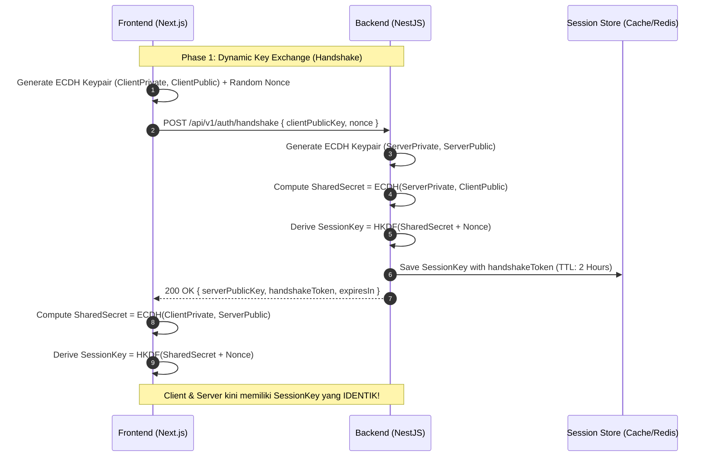
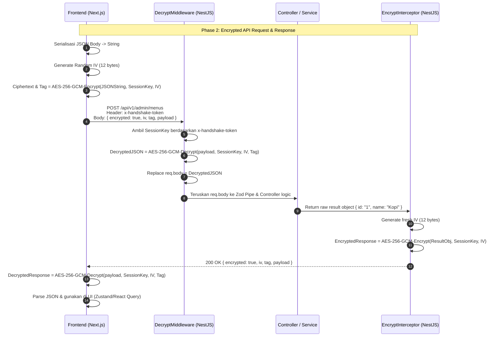
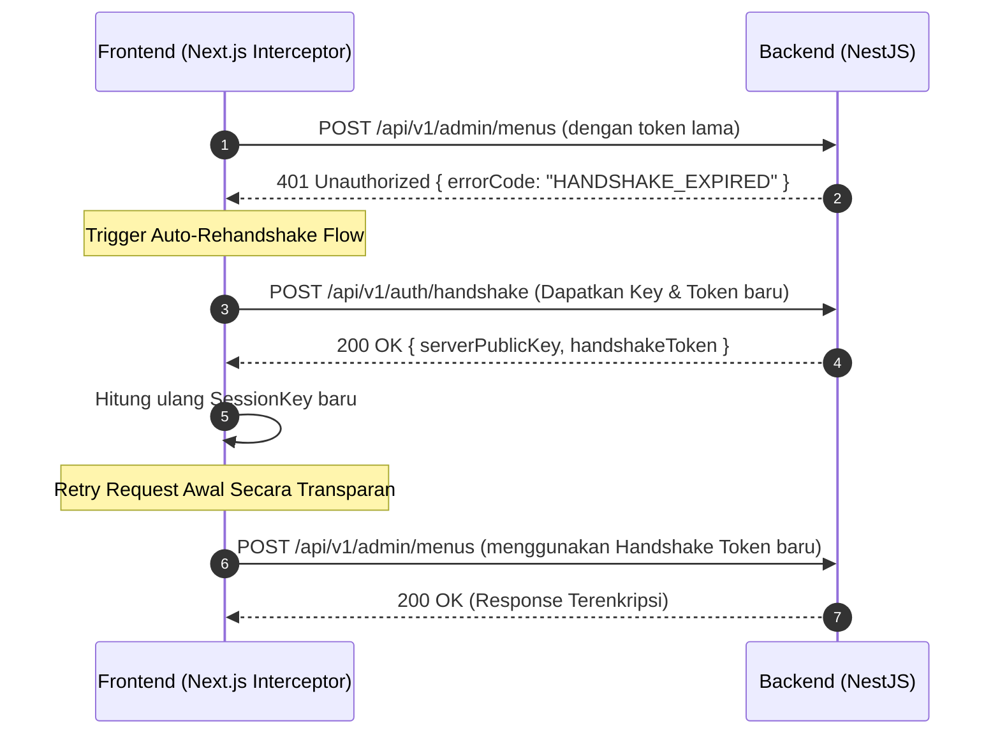

# Payload Encryption & Decryption Strategy (ECDH Handshake & AES-256-GCM)

> **Document Status**: Complete Architecture Specification  
> **Target Scope**: Next.js (Frontend Client) & NestJS (Backend Server)  
> **Security Model**: Zero-Trust End-to-End Payload Encryption via ECDH Key Exchange + AES-256-GCM  

---

## 🎯 1. Overview & Objective

Untuk mencegah *Man-In-The-Middle (MITM)*, *payload tampering*, serta memblokir pemindaian data sensitif melalui *Network Inspection/Proxy*, aplikasi **MenuScan** menerapkan **Payload Encryption at Application Layer**.

Setiap *Request Body* dan *Response Payload* dienkripsi secara dinamis menggunakan **Session Key** unik yang dihasilkan dari proses **ECDH (Elliptic-Curve Diffie-Hellman) Handshake** saat sesi aplikasi dibuka.

---

## 🔐 2. Spesifikasi Kriptografi

| Komponen | Spesifikasi | Deskripsi / Fungsi |
| :--- | :--- | :--- |
| **Key Exchange Protocol** | **ECDH (prime256v1 / secp256r1)** | Pertukaran kunci tanpa mengirimkan secret key melalui jaringan. |
| **Key Derivation Function** | **HKDF (HMAC-SHA256)** | Mengkonversi ECDH Shared Secret + Nonce menjadi 256-bit Session Key. |
| **Symmetric Cipher** | **AES-256-GCM** | Authenticated Encryption dengan IV 12-byte & Auth Tag 16-byte. |
| **Session Lifetime** | **2 Jam (Configurable)** | Session Key akan otomatis *expire* dan melakukan *auto-rehandshake*. |

---

## 🤝 3. Alur Detail ECDH Handshake Protocol

Proses handshake dilakukan **sekali** saat aplikasi Next.js pertama kali dimuat atau ketika sesi handshake kadaluarsa.



### Langkah demi Langkah Handshake:
1. **Client Key Generation**: Frontend membuat pasangan kunci ECDH ephemeral (`ClientPrivateKey`, `ClientPublicKey`) dan sebuah `ClientNonce` acak.
2. **Handshake Request**: Client mengirim `POST /api/v1/auth/handshake` berisi `{ clientPublicKey, nonce }`.
3. **Server Key Generation & Derivation**:
   - Server membuat pasangan kunci ECDH ephemeral (`ServerPrivateKey`, `ServerPublicKey`).
   - Server menghitung *Shared Secret*: `SharedSecret = ECDH(ServerPrivateKey, ClientPublicKey)`.
   - Server menurunkan *Session Key* 256-bit: `SessionKey = HKDF-Expand(HKDF-Extract(SharedSecret), Nonce)`.
   - Server membuat `handshakeToken` (UUID/JWT) dan menyimpannya di Memory Store/Redis bersama `SessionKey`.
4. **Handshake Response**: Server membalas dengan `{ serverPublicKey, handshakeToken, expiresIn }`.
5. **Client Derivation**: Client menghitung *Shared Secret* yang sama: `SharedSecret = ECDH(ClientPrivateKey, ServerPublicKey)`, lalu menurunkan `SessionKey` dengan rumus HKDF yang identik.

---

## 🔄 4. Alur Transaksi HTTP Request & Response Terenkripsi

Setelah Handshake selesai, seluruh transaksi HTTP berikutnya menggunakan `SessionKey` tersebut.



---

## 📥 5. Spesifikasi Request Handling (Frontend -> Backend)

### Header Wajib:
```http
x-handshake-token: 9b1deb4d-3b7d-4bad-9bdd-2b0d7b3dcb6d
Content-Type: application/json
```

### Body Request Terenkripsi:
```json
{
  "encrypted": true,
  "iv": "dGhpcyBpcyBhbiBpdiAxMg==",
  "tag": "YXV0aCB0YWcgMTYgYnl0ZXM=",
  "payload": "S2VzZWx1cnVoYW4gZGF0YSBqc29uIHlhbmcgc3VkYWggZGllbmtyaXBzaQ=="
}
```

### Penanganan di NestJS (`DecryptMiddleware`):
1. Membaca header `x-handshake-token`. Jika tidak ada $\rightarrow$ `401 Handshake Header Missing`.
2. Mencari `SessionKey` di Cache/Session Store. Jika kadaluarsa $\rightarrow$ `401 Handshake Expired`.
3. Mendeskripsi `payload` menggunakan `SessionKey`, `iv`, dan `tag`.
4. Jika `tag` tidak valid (data dimanipulasi) $\rightarrow$ `400 Invalid Payload Integrity`.
5. Mengisi `req.body` dengan JSON asli yang terdekripsi agar bisa divalidasi oleh `Zod Validation Pipe`.

---

## 📤 6. Spesifikasi Response Handling (Backend -> Frontend)

### Penanganan di NestJS (`EncryptInterceptor`):
1. Mengambil `SessionKey` yang terhubung dengan request saat ini.
2. Menggenerasi IV acak 12-byte baru (`crypto.randomBytes(12)`).
3. Enkripsi objek response controller dengan AES-256-GCM.
4. Mengembalikan HTTP Response dalam bentuk JSON terenkripsi:
   ```json
   {
     "encrypted": true,
     "iv": "<fresh_base64_iv>",
     "tag": "<base64_auth_tag>",
     "payload": "<encrypted_response_ciphertext>"
   }
   ```

### Penanganan di Next.js (Axios / Fetch Interceptor):
1. Response Interceptor memeriksa apakah body berisi `"encrypted": true`.
2. Jika ya, dekripsi `payload` menggunakan `SessionKey` lokal, `iv`, dan `tag`.
3. Mengembalikan objek JavaScript asli ke komponen UI.

---

## 🔄 7. Penanganan Handshake Expired (Auto-Retry Mechanism)

Jika `SessionKey` di backend telah kadaluarsa (misal setelah 2 jam tidak aktif):



Dengan mekanisme ini, pengguna restoran/admin **tidak akan mengalami error** atau terganggu saat sesi handshake kadaluarsa karena Next.js Axios Interceptor akan melakukan *silent re-handshake* di latar belakang.
