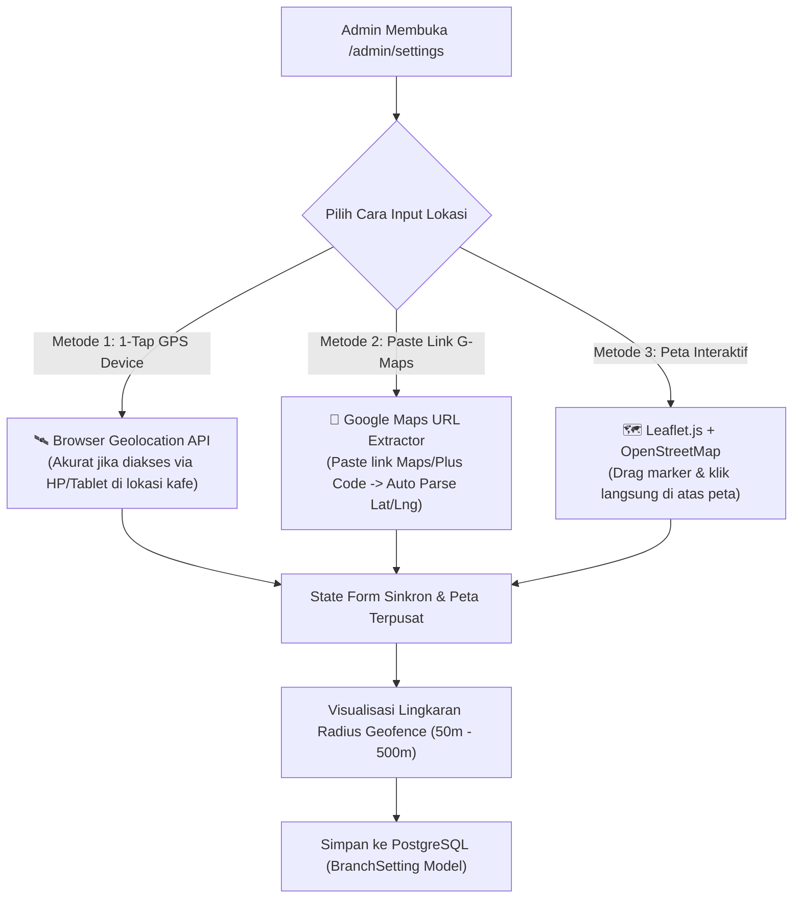
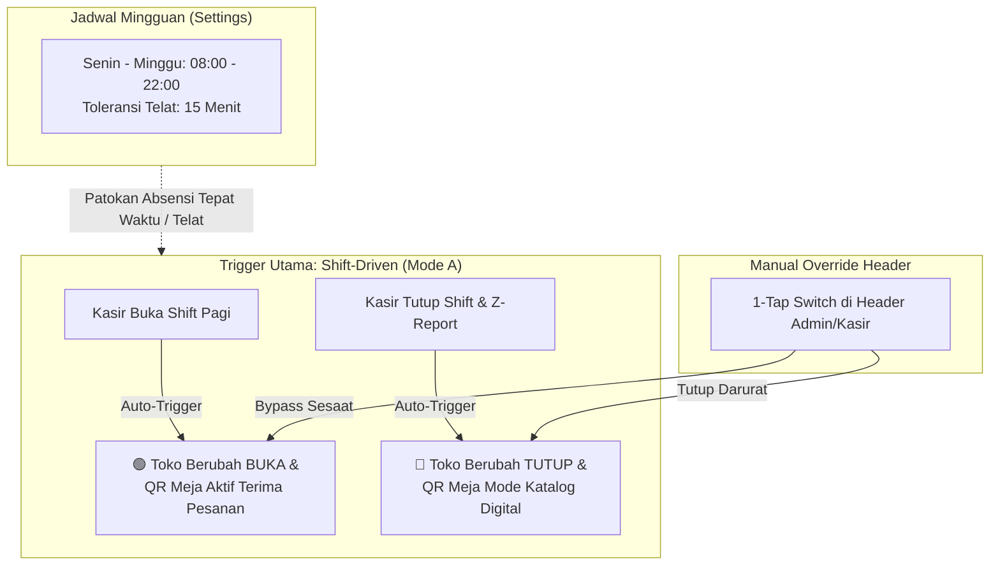
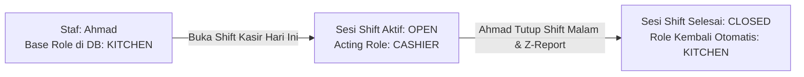
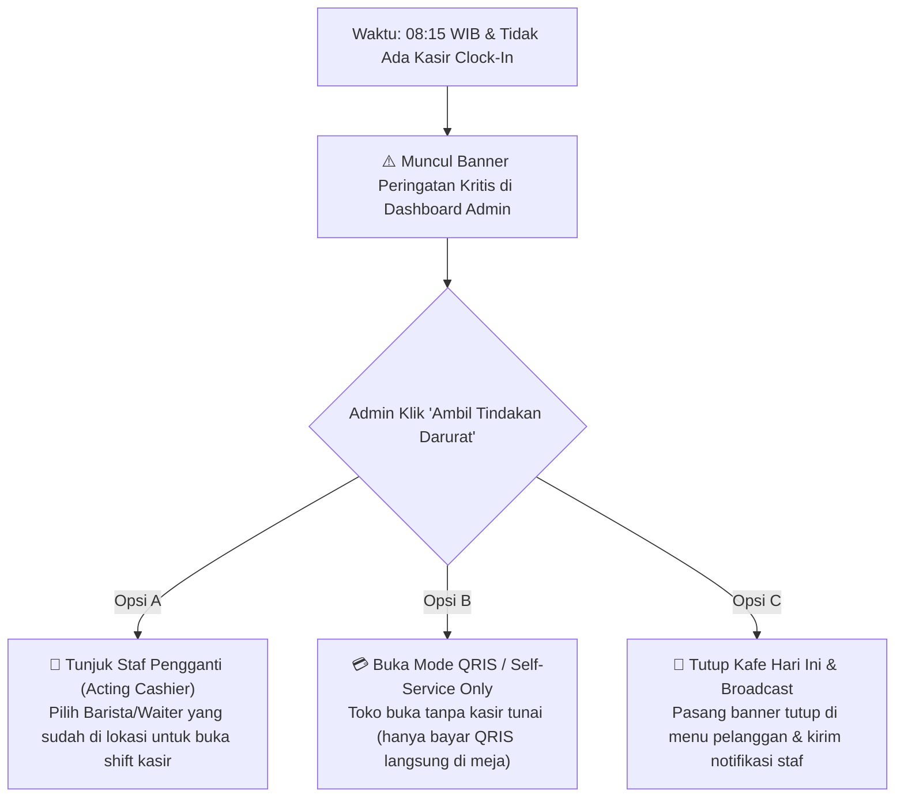

# Branch Settings, Geofencing, & Operational Contingency Blueprint

> **Project**: Kumpul Cafe – Digital QR Code Menu System & Multi-Branch FnB SaaS  
> **Scope**: Tahap 2 – Pengaturan Lokasi Cabang, Radius Geofence, Jam Operasional, Delegasi Shift Sementara, & Alert Ketidakhadiran Staf  
> **Document Location**: `docs/fe/architecture/branch-settings-and-geofence-blueprint.md`  
> **Status**: APPROVED ARCHITECTURAL SPECIFICATION  

---

## 🧭 1. Executive Summary & Visi Fitur

Dokumen ini mendefinisikan arsitektur menyeluruh untuk **Pengaturan Cabang & Geofence Spasial (`/admin/settings`)**. Fitur ini menjadi fondasi spasial dan operasional bagi:
1. **Presensi Cerdas Staf (Smart Attendance)**: Validasi jarak fisik staf terhadap titik pusat kafe ($\le 100$ meter) sebelum mengizinkan input PIN Clock-In 4-digit.
2. **Jadwal Operasional Resmi**: Mengatur jam buka/tutup mingguan dan toleransi keterlambatan (*grace period*).
3. **Kontrol Status Toko (Store Status Control)**: Menentukan kapan meja QR pelanggan aktif menerima pesanan atau hanya berstatus katalog digital.
4. **Delegasi Shift Sementara (*Temporary Shift Delegation*)**: Memungkinkan staf non-kasir (misal Barista/Kitchen) mengambil alih meja kasir tanpa mengubah *base role* permanen di database.
5. **Mesin Kontingensi Ketidakhadiran (*Critical Staff Absence Contingency Engine*)**: Deteksi proaktif jika tidak ada kasir yang hadir saat jam buka kafe, dilengkapi 3 opsi tindakan darurat 1-klik untuk Admin.

---

## 🏛️ 2. Arsitektur Input Lokasi: "3-Way Hybrid Geolocation"

Untuk mengatasi kelemahan GPS browser pada perangkat desktop/laptop (yang sering membaca lokasi IP ISP alih-alih lokasi fisik kafe), sistem menyediakan 3 metode input sinkron:



### A. Formula Geodesik Haversine
Perhitungan jarak antara koordinat perangkat staf $(\text{lat}_1, \text{lon}_1)$ dengan koordinat kafe $(\text{lat}_2, \text{lon}_2)$ menggunakan rumus Haversine:

$$d = 2R \cdot \arcsin\left(\sqrt{\sin^2\left(\frac{\Delta\text{lat}}{2}\right) + \cos(\text{lat}_1)\cos(\text{lat}_2)\sin^2\left(\frac{\Delta\text{lon}}{2}\right)}\right)$$

* $R = 6.371.000\text{ meter}$ (Jari-jari bola bumi).
* Utility terpusat di `src/lib/utils/haversine.ts`.

---

## ⏰ 3. Jadwal Operasional & Kontrol Status Toko

Sistem membedakan secara tegas antara **Jadwal Resmi (Informasi & Acuan Absensi)** dan **Kondisi Real-Time di Lapangan**:



### Aturan Mode Operasional:
1. **Mode A (*Shift-Driven* - Default & Paling Aman)**:
   * Meja QR pelanggan hanya dapat mengirim pesanan jika ada staf yang sedang membuka shift kasir aktif.
   * Mencegah pesanan masuk saat kafe kosong / belum ada staf yang bertugas.
2. **Mode B (*Clock-Driven*)**:
   * Toko otomatis buka tepat di jam `openTime` (misal 08:00) sesuai jadwal mingguan.
3. **Manual Override (Header Status Switch)**:
   * Sakelar manual di header yang memungkinkan Admin/Kasir membuka atau menutup toko kapan saja untuk kebutuhan darurat (misal: *private party*, mati lampu, stok habis).

---

## 🔄 4. Delegasi Shift Sementara (*Temporary Shift Delegation*)

Untuk menghindari bahaya salah mengubah atau lupa mengembalikan role staf di database jika kasir berhalangan hadir:



### Prinsip Delegasi:
* **Zero DB Mutation on User Table**: Field `role` staf Ahmad di tabel `users` tetap `KITCHEN`.
* **Izin Melekat Pada Sesi Shift**: Selama Ahmad memegang shift kasir yang aktif (`status: OPEN` di tabel `shifts`), Ahmad memiliki wewenang kasir untuk memproses transaksi.
* **Auto-Revert**: Saat shift ditutup dan Z-Report dicetak malam hari, wewenang kasir otomatis berakhir tanpa perlu intervensi manual dari Admin.

---

## 🚨 5. Mesin Kontingensi Ketidakhadiran Staf Kunci (*Critical Staff Absence Alert*)

Jika jam operasional telah melewati `openTime + lateGracePeriod` (misal `08:00 + 15 menit = 08:15`) dan **belum ada staf kasir yang clock-in atau membuka shift**, sistem memicu alur kontingensi:



### Rincian 3 Opsi Tindakan Darurat:
* **Opsi A (Tunjuk Staf Pengganti)**: Memilih staf yang sudah hadir di lokasi untuk didelegasikan sebagai *Acting Cashier*.
* **Opsi B (Buka Mode QRIS-Only)**: Kafe tetap buka, pesanan dari scan QR meja tetap masuk ke Kitchen Display System (KDS), namun opsi pembayaran tunai di kasir dinonaktifkan sementara.
* **Opsi C (Tutup Kafe Hari Ini)**: Kafe ditandai tutup untuk hari ini dan memunculkan banner informatif di layar pelanggan: *"Mohon maaf, kafe hari ini tutup sementara untuk pemeliharaan operasional"*.

---

## 🗄️ 6. Spesifikasi Skema Database & REST API

### A. Skema Prisma (`prisma/schema.prisma`)
```prisma
model BranchSetting {
  id                 String   @id @default(uuid())
  name               String   @default("Kumpul Cafe - Cabang Pusat")
  address            String   @default("Jl. Tebet Raya No. 45, Jakarta Selatan")
  latitude           Float    @default(-6.2297465)
  longitude          Float    @default(106.8557342)
  geofenceRadius     Int      @default(100) @map("geofence_radius") // dalam meter
  openTime           String   @default("08:00") @map("open_time")
  closeTime          String   @default("22:00") @map("close_time")
  lateGracePeriod    Int      @default(15) @map("late_grace_period") // dalam menit
  isStoreOpen        Boolean  @default(false) @map("is_store_open")
  storeMode          String   @default("SHIFT_DRIVEN") @map("store_mode") // SHIFT_DRIVEN | CLOCK_DRIVEN | QRIS_ONLY | EMERGENCY_CLOSED
  timezone           String   @default("Asia/Jakarta")
  phone              String?
  email              String?
  createdAt          DateTime @default(now()) @map("created_at")
  updatedAt          DateTime @updatedAt @map("updated_at")

  @@map("branch_settings")
}
```

### B. Endpoints REST API:
1. `GET /api/v1/admin/settings/branch`: Mengambil data pengaturan cabang & geofence lengkap (Role: `ADMIN`).
2. `PUT /api/v1/admin/settings/branch`: Memperbarui data lokasi, koordinat, radius, dan jadwal (Role: `ADMIN`).
3. `PUT /api/v1/admin/settings/branch/store-status`: Toggle manual status toko Buka/Tutup/QRIS-Only (Role: `ADMIN`, `CASHIER`).
4. `GET /api/v1/public/branch/location`: Endpoint publik ringan untuk pengecekan koordinat radius geofence saat absensi staf & pemesanan meja.

---

## 🧪 7. Quality Gate & Standard Test Plan
1. **Haversine Math Unit Tests**: Memvalidasi akurasi perhitungan jarak meter pada berbagai koordinat bumi.
2. **Google Maps Link Parser Tests**: Memvalidasi ekstraksi regex koordinat dari format URL standar, shortlink, dan Plus Code.
3. **Form Validation Tests**: Memvalidasi form pengaturan cabang dengan `react-hook-form` + `zodResolver`.
4. **Shift Contingency Tests**: Memvalidasi 3 opsi aksi darurat saat tidak ada kasir yang hadir.
