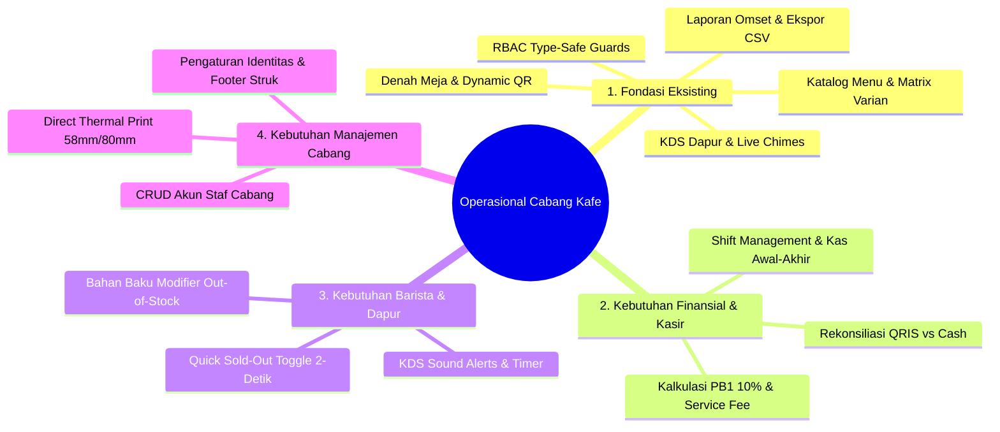

# Blueprint & Spesifikasi Operasional Cabang Kafe (Frontend Perspective)

> **Project**: Kumpul Cafe – Digital QR Code Menu & Multi-Branch FnB SaaS  
> **Target Audience**: Branch Manager, Kasir, Head Barista, Chef Dapur, Pelayan  
> **Document Location**: `docs/fe/architecture/cafe-branch-operational-blueprint.md`  
> **Status**: APPROVED ARCHITECTURE BLUEPRINT  

---

## 🎯 1. Executive Summary & POV Operasional Cabang

Dalam operasional harian cabang kafe (*real-world F&B outlet*), antarmuka Admin dan POS tidak hanya berfungsi sebagai katalog statis, melainkan menjadi **pusat komando operasional** (*operational mission control*).

Dokumen ini memetakan seluruh kebutuhan operasional kafe ke dalam komponen arsitektur Frontend Next.js 16 yang modular, responsif, dan terbagi secara tipe-aman (*type-safe*).



---

## 🧱 2. Matriks Modul Frontend (Existing vs Operational Roadmap)

| Modul Operasional | Status Frontend | Lokasi Direktori | Deskripsi & Komponen Utama |
| :--- | :---: | :--- | :--- |
| **Katalog Menu & Varian** | 🟢 **100% Ready** | `src/components/menus/` | `MenuTable`, `MenuForm`, `MenuCardsMobile`, `MenuFilterBar`, `CategoryManagerModal` |
| **Denah Meja & QR Code** | 🟢 **100% Ready** | `src/components/tables/` | `TablesView`, `TableFormModal`, `TableQrModal`, `TableResetModal`, `ZoneManagerModal` |
| **Kitchen Display (KDS)** | 🟢 **100% Ready** | `src/components/orders/` | `OrdersView`, `OrderCard`, `OrderReceiptModal`, Web Audio Chimes |
| **Laporan & Analitik** | 🟢 **100% Ready** | `src/components/reports/` | `ReportDateFilter`, `RevenueSummaryCards`, `TopSellingTable`, `OrdersStatusBreakdown`, `ExportReportButton` |
| **Rekonsiliasi Pembayaran** | 🟡 **Planned (P1)** | `src/components/reports/` & `orders/` | Breakdown `QRIS` vs `CASH` vs `DEBIT`, settlement matcher, kartu rekap kasir |
| **Quick Sold-Out Switch** | 🟡 **Planned (P1)** | `src/components/menus/` | 1-Tap Toggle ketersediaan langsung pada tabel tanpa buka form edit |
| **Shift Kasir & Z-Report** | 🟡 **Planned (P2)** | `src/components/shifts/` | Modal buka kasir (kas modal awal), rekap transaksi shift, input kas fisik, selisih kas, cetak Z-Report |
| **Pajak PB1 & Service Fee** | 🟡 **Planned (P2)** | `src/components/settings/` | Toggle tarif PB1 (10%), Service Charge (5%), status inclusive/exclusive tax |
| **Manajemen Staf Cabang** | 🟡 **Planned (P2)** | `src/components/staff/` | Tabel staf, form tambah kasir/barista, reset password/PIN, aktivasi akun |
| **Profil Kafe & Thermal Print** | 🟡 **Planned (P3)** | `src/components/settings/` | Header/Footer struk, WiFi info, template ESC/POS 58mm & 80mm |

---

## 🛠️ 3. Arsitektur Komponen & State Management

### A. Rekonsiliasi Metode Pembayaran (`QRIS` vs `CASH`)
- **Tujuan**: Memisahkan pendapatan uang digital (otomatis masuk ke rekening via Payment Gateway) dengan uang fisik di laci kasir (*cash drawer*).
- **Komponen FE**:
  - `PaymentMethodPieChart.tsx` / `PaymentBreakdownCards.tsx`: Menampilkan rasio nominal & volume transaksi per metode pembayaran.
  - `CashDrawerSummary.tsx`: Menghitung total uang tunai yang harus disetorkan ke owner di akhir hari.

### B. Quick "Sold-Out" Switch (Barista Rush Hour)
- **Tujuan**: Saat jam sibuk, barista dapat mematikan ketersediaan menu dalam 2 detik.
- **Komponen FE**:
  - Penambahan `<Switch checked={menu.isAvailable} onCheckedChange={(val) => toggleMenuStatus({ id, isAvailable: val })} />` langsung di kolom status `MenuTable.tsx` dan `MenuCardsMobile.tsx`.
  - Optimistic UI updates menggunakan TanStack Query cache.

### C. Modul Manajemen Shift Kasir (`src/components/shifts/`)
- **Tujuan**: Menghindari kebocoran kas kasir dan mempermudah pergantian shift (*Pagi $\rightarrow$ Sore*).
- **Alur Antarmuka**:
  1. **Open Shift Modal**: Kasir memasukkan nominal kas awal (misal: Rp 200.000 untuk uang kembalian).
  2. **Active Shift Indicator**: Banner kecil di header menampilkan kasir aktif & durasi shift.
  3. **Close Shift Modal (Z-Report)**:
     - Sistem menampilkan total transaksi tunai tercatat.
     - Kasir menginput jumlah uang fisik aktual di laci.
     - Sistem menghitung otomatis: `Selisih (Variance) = Uang Fisik - Ekspektasi Kasir`.
     - Tombol **Cetak Struk Tutup Shift (Z-Report)**.

### D. Modul Manajemen Staf Cabang (`src/app/(dashboard)/admin/staff/`)
- **Tujuan**: Branch manager dapat mengelola akun kasir, barista/chef, dan waiter tanpa bantuan teknisi backend.
- **Komponen FE**:
  - `StaffTable.tsx`: Menampilkan daftar nama staf, email/username, role badge (`CASHIER`, `KITCHEN`, `WAITER`), dan status aktif.
  - `StaffFormModal.tsx`: Modal form tambah/edit staf dengan validasi Zod.
  - `StaffResetPasswordModal.tsx`: Modal ganti PIN / password cepat untuk staf.

---

## 🔒 4. Keamanan & Role Access Enforcement

Semua modul baru wajib mengikuti standar arsitektur keamanan:
1. Terbungkus `<RoleGuard allowedRoles={[ROLE.ADMIN]}>` untuk pengaturan krusial (Laporan, Pajak, Staf).
2. Modul Shift Kasir dapat diakses oleh `ROLE_GROUPS.CASHIER_OR_ADMIN`.
3. Seluruh request API melalui `hardenedFetch` dengan validasi runtime Zod Schema.

---

## 📌 5. Target Rencana Eksekusi Frontend

```
Milestone FE-Ops.1 (Quick Wins):
  ├── Quick Sold-Out Switch pada MenuTable & MenuCardsMobile
  └── Payment Method Breakdown pada Laporan (/admin/reports)

Milestone FE-Ops.2 (Kasir & Administrasi):
  ├── Shift Management (Kas Modal Awal, Tutup Kasir, Z-Report)
  └── Staff Management (/admin/staff)

Milestone FE-Ops.3 (Outlet Settings & Thermal Print):
  ├── Branch & Receipt Settings (/admin/settings)
  └── Web Bluetooth / ESC-POS Thermal Printer Integration
```
