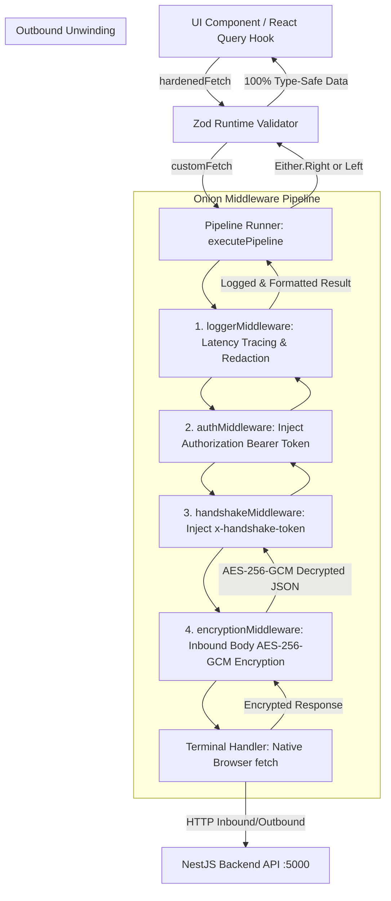
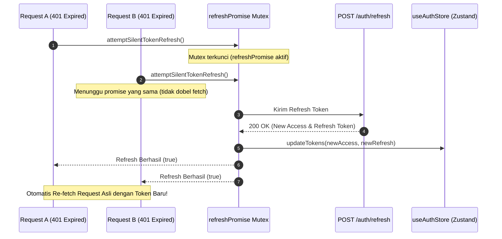

# Interceptor Middleware Pipeline & Hardened Fetch Architecture

> **Scope**: Next.js 16 Frontend API Client Layer  
> **Source Code Location**: `src/lib/api/pipeline/` & `src/lib/api/hardened-fetch.ts`  
> **Document Location**: `docs/fe/architecture/interceptor-pipeline-architecture.md`  
> **Status**: APPROVED TECHNICAL SPECIFICATION  

---

## 🎯 1. Overview & Architecture Pattern

Aplikasi Frontend **Kumpul Cafe** tidak menggunakan library HTTP client eksternal seperti Axios, melainkan mengadopsi **Modular Onion-Style Middleware Pipeline** berbasis **Native `fetch`** browser yang terenkripsi dan type-safe.

Arsitektur ini memisahkan secara tegas antara:
1. **Network Transport Execution** (`terminalFetch`)
2. **Cross-Cutting Concerns** (Logging, Autentikasi JWT, Handshake ECDH, Enkripsi AES-256-GCM)
3. **Runtime Schema Validation** (`hardenedFetch` + Zod)
4. **Error Handling Contract** (`Either<ApiError, T>`)



---

## 📁 2. Direktori & Struktur File Pipeline

```text
src/lib/api/
├── pipeline/
│   ├── pipeline-runner.ts       # 👑 Orchestrator pipeline, terminal fetch, & mutex token refresh
│   ├── logger-middleware.ts     # 📝 Interceptor 1: Tracing durasi (latency) & logging
│   ├── auth-middleware.ts       # 🔑 Interceptor 2: Auto-inject Authorization: Bearer <token>
│   ├── handshake-middleware.ts  # 🤝 Interceptor 3: Auto-inject x-handshake-token (ECDH)
│   ├── encryption-middleware.ts # 🔒 Interceptor 4: AES-256-GCM Encrypt (inbound) & Decrypt (outbound)
│   └── types.ts                 # 📐 Definisi PipelineContext, Middleware, & NextFunction
│
├── hardened-fetch.ts            # 🛡️ Zod runtime contract hardening wrapper
├── custom-fetch.ts              # 🌐 Universal fetch entrypoint
├── either.ts                    # ⚖️ Functional Either<ApiError, T> pattern
├── api-error.ts                 # 🚨 Normalized application error class
└── error-translator.ts          # 🌐 Human-friendly error translation engine
```

---

## 🔍 3. Rincian Middleware & Lifecycle Interceptor

### A. `PipelineContext` Interface (`types.ts`)
Setiap request membawa objek konteks yang dapat dibaca dan dimutasi oleh middleware:
```typescript
export interface PipelineContext<T = unknown> {
  url: string;
  method: string;
  headers: Record<string, string>;
  body?: unknown;
  options: CustomFetchOptions;
  sessionKey?: CryptoKey | null;
  rawResponse?: Response;
  responseData?: T;
  startTime?: number;
  durationMs?: number;
}
```

### B. `loggerMiddleware.ts` (Tracing & Redaction)
* **Pre-Execution**: Mencatat `startTime` dan mencetak log request masuk.
* **Post-Execution**: Menghitung `durationMs = Date.now() - startTime` dan mencatat status HTTP response.
* **Data Redaction**: Secara otomatis menyamarkan field sensitif seperti `password`, `token`, `authorization`, dan payload enkripsi.

### C. `authMiddleware.ts` (JWT Injection)
* Membaca `accessToken` dari Zustand `useAuthStore.getState()`.
* Jika token tersedia dan `options.skipAuth !== true`, menyuntikkan header:
  `Authorization: Bearer <accessToken>`.

### D. `handshakeMiddleware.ts` (ECDH Key Session)
* Memanggil `ensureHandshakeSession()` untuk memastikan browser memiliki kunci simetris aktif.
* Menyuntikkan header: `x-handshake-token: <handshakeToken>` dan melampirkan `sessionKey` ke `ctx.sessionKey`.

### E. `encryptionMiddleware.ts` (Zero-Trust Cryptography)
* **Inbound (Sebelum fetch)**:
  Jika `options.skipEncryption !== true` dan terdapat `ctx.body`, middleware mengenkripsi payload menggunakan AES-256-GCM (SubtleCrypto) menjadi `{ ciphertext, iv, tag }`.
* **Outbound (Setelah `await next()`)**:
  Jika backend mengembalikan ciphertext terenkripsi, middleware mendekripsi data tersebut kembali menjadi objek JavaScript murni sebelum diteruskan ke UI.

---

## ⚡ 4. Single-Flight Mutex Auto Token Refresh (`pipeline-runner.ts`)

Saat terjadi `401 Unauthorized` (Token kadaluarsa), `pipeline-runner.ts` menerapkan pola **Single-Flight Mutex Promise** untuk mencegah *race condition* (banyak request paralel memicu refresh token berulang-ulang):



---

## 🛡️ 5. Hardened Fetch & Runtime Zod Contract (`hardened-fetch.ts`)

`hardenedFetch` menggabungkan transport layer dengan validasi runtime Zod:

```typescript
export async function hardenedFetch<TSchema extends z.ZodTypeAny>(
  endpoint: string,
  schema: TSchema,
  options: CustomFetchOptions = {}
): Promise<Either<ApiError, z.infer<TSchema>>> {
  // 1. Eksekusi secure transport pipeline
  const rawResult = await customFetch<unknown>(endpoint, options);
  if (rawResult.isLeft()) return left(rawResult.value);

  // 2. Validasi struktur response dengan Zod Schema
  const parseResult = schema.safeParse(rawResult.value);
  if (!parseResult.success) {
    logger.error({ endpoint, issues: parseResult.error.issues }, 'Contract Violation Error');
    return left(ApiError.contractViolation(endpoint, parseResult.error.issues));
  }

  // 3. Return data 100% type-safe dalam Right container
  return right(parseResult.data);
}
```

---

## 🔗 6. Dokumen Terkait
- 📄 Spesifikasi Arsitektur Frontend: [architecture-design.md](file:///d:/code/fe-menu-scan-latihan/docs/fe/architecture/architecture-design.md)
- 📄 Spesifikasi Kriptografi Client: [client-crypto-strategy.md](file:///d:/code/fe-menu-scan-latihan/docs/fe/security/client-crypto-strategy.md)
- 📄 Spesifikasi Backend Architecture: [architecture-design.md (Backend)](file:///d:/code/fe-menu-scan-latihan/docs/be/architecture/architecture-design.md)
