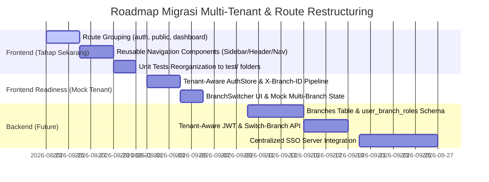

# FnB Multi-Tenant SaaS Architecture: Centralized Auth & Tenant-Aware Routing

> **Document**: `docs/fe/architecture/multi-tenant-auth-and-routing.md`  
> **Status**: APPROVED ARCHITECTURE BLUEPRINT  
> **Target System**: Multi-Branch FnB SaaS & Digital QR Ordering Platform  
> **Frontend Stack**: Next.js 16 (App Router, TypeScript, Tailwind CSS v4, Zustand, TanStack Query)  
> **Security & Tokens**: Centralized Identity Provider (IdP/SSO) + Tenant-Bound JWT + WebCrypto Zero-Trust  

---

## 📌 Executive Summary

Dokumen ini mendefinisikan arsitektur menyeluruh transformasi platform dari sistem single-outlet menjadi **Multi-Tenant / Multi-Branch FnB SaaS Platform**.

Arsitektur mengadopsi prinsip **Centralized Auth + Tenant-Aware Token System**, di mana identitas pengguna dikelola terpusat (*Single Sign-On*), sementara hak akses, peran (*role*), dan alur operasional diikat secara kontekstual ke **Tenant (Branch/Cabang)** aktif yang sedang diakses.

```mermaid
flowchart TD
    subgraph Identity & SSO Layer
        A[User Login /auth.fnbapp.com] --> B[Universal Identity Verification]
        B --> C{Branch Access Count}
        C -->|1 Cabang| E[Issue Tenant-Aware JWT]
        C -->|> 1 Cabang| D[Branch Selection Screen]
        D --> E
    end

    subgraph App Shell (dashboard.fnbapp.com)
        E --> F["App Shell Context (Active Branch: Cabang Bandung 01)"]
        F --> G[CommonHeader + Branch Switcher Dropdown]
        F --> H[CommonSidebar Dynamic Menu]
        F --> I[API Pipeline: Inject Header X-Branch-ID]

        F --> J{Active Role}
        J -->|ADMIN / SUPERADMIN| K["/admin/dashboard, /admin/menus, /admin/tables"]
        J -->|KITCHEN| L["/kitchen/orders (KDS)"]
        J -->|CASHIER| M["/cashier/tables, /cashier/pos"]
        J -->|WAITER| N["/waiter/tables"]
    end

    subgraph Public QR Layer
        P["QR Menu Scan: /menu?branch=br_bdg_01&table=01"]
    end
```

---

## 🏛️ 1. Centralized Auth & Tenant-Aware Token Model

### A. Konsep Entitas Relasional
- **`users`**: Identitas universal (`id`, `name`, `email`, `password_hash`, `is_superadmin`).
- **`branches`**: Entitas cabang/outlet (`id`, `name`, `code`, `address`, `timezone`, `status`).
- **`roles`**: Definisi peran (`SUPERADMIN`, `ADMIN`, `CASHIER`, `KITCHEN`, `WAITER`).
- **`user_branch_roles`**: Pivot tabel (`user_id`, `branch_id`, `role_id`, `permissions`).

### B. Struktur Payload JWT (Tenant-Aware Token)
Setelah login dan cabang aktif dipilih, token JWT memuat konteks cabang yang mengikat:

```json
{
  "sub": "usr_78901",
  "name": "Budi Pratama",
  "email": "budi@kumpulcafe.com",
  "is_superadmin": false,
  "active_branch": {
    "id": "br_bdg_01",
    "name": "Kumpul Cafe - Bandung Dipatiukur",
    "code": "BDG-01",
    "role": "CASHIER",
    "permissions": [
      "pos:create_order",
      "pos:process_payment",
      "tables:manage_session"
    ]
  },
  "available_branches": [
    {
      "id": "br_bdg_01",
      "name": "Kumpul Cafe - Bandung Dipatiukur",
      "code": "BDG-01",
      "role": "CASHIER"
    },
    {
      "id": "br_jkt_02",
      "name": "Kumpul Cafe - Jakarta Senopati",
      "code": "JKT-02",
      "role": "WAITER"
    }
  ],
  "iat": 1787420000,
  "exp": 1787448800
}
```

### C. Matriks Hak Akses & Perilaku Role

| Peran (Role) | Lingkup Cabang | Alur URL Utama | Fitur & Akses |
| :--- | :--- | :--- | :--- |
| **SUPERADMIN** | Global (Lintas Cabang) | `/admin/dashboard` | Akses semua cabang, rekap omset global, manajemen cabang (`X-Branch-ID: *`). |
| **ADMIN (Branch Mgr)** | 1 atau beberapa cabang | `/admin/dashboard` | Pengaturan menu, kategori, denah meja, laporan omset cabang aktif. |
| **KITCHEN (Dapur)** | Terikat 1 cabang aktif | `/kitchen/orders` | Kitchen Display System (KDS), ubah status pesanan (`PREPARING` $\rightarrow$ `READY`). |
| **CASHIER (Kasir)** | Terikat 1 cabang aktif | `/cashier/tables` | Billing, POS, pemantauan status meja, pembayaran pesanan. |
| **WAITER (Pelayan)** | Terikat 1 cabang aktif | `/waiter/tables` | Pemantauan meja terisi, panggil kasir, bantuan tamu. |

---

## 🗂️ 2. Spesifikasi Struktur Folder & Route Grouping Frontend

Untuk memastikan kode siap bermigrasi tanpa refactor besar saat Backend multi-cabang aktif, Frontend mengadopsi struktur route group semantik berikut:

```text
src/app/
├── not-found.tsx                     # 🌍 Global Public 404
├── page.tsx                          # 🏠 Landing / Portal Switcher
│
├── (auth)/                           # 🔐 Clean URL Auth Group
│   ├── login/                        # /login -> Universal Staff Login
│   │   └── page.tsx
│   └── select-branch/                # /select-branch -> Branch Selection Screen
│       └── page.tsx
│
├── (public)/                         # 📱 Public Customer Route Group
│   ├── layout.tsx                    # Public Mobile-First Shell
│   ├── menu/                         # /menu?table=01 -> QR Menu Catalog
│   │   └── page.tsx
│   └── scan/                         # /scan -> In-App QR Scanner
│       └── page.tsx
│
└── (dashboard)/                      # 🖥️ Internal Operational & Admin Portal
    ├── layout.tsx                    # Shared Dashboard Layout (Header + Sidebar + BottomNav)
    ├── not-found.tsx                 # 📊 Dashboard 404 Error Card
    │
    ├── admin/                        # 👑 Scope Admin / Management
    │   ├── dashboard/                # /admin/dashboard -> Omset & KPI
    │   │   └── page.tsx
    │   ├── menus/                    # /admin/menus -> Katalog Menu CRUD
    │   │   ├── page.tsx
    │   │   ├── create/page.tsx
    │   │   ├── edit/[id]/page.tsx
    │   │   └── detail/[id]/page.tsx
    │   ├── categories/               # /admin/categories -> Kategori Menu
    │   │   └── page.tsx
    │   ├── tables/                   # /admin/tables -> Manajemen Meja & Zona
    │   │   └── page.tsx
    │   └── orders/                   # /admin/orders -> Log Riwayat Pesanan
    │       └── page.tsx
    │
    ├── kitchen/                      # 🍳 Scope Kitchen Staff
    │   └── orders/                   # /kitchen/orders -> Kitchen Display System (KDS)
    │       ├── page.tsx
    │       └── not-found.tsx
    │
    ├── cashier/                      # 💳 Scope Cashier Staff
    │   └── tables/                   # /cashier/tables -> Denah Meja & Kasir Billing
    │       ├── page.tsx
    │       └── not-found.tsx
    │
    └── waiter/                       # 🤵 Scope Waiter Staff
        └── tables/                   # /waiter/tables -> Denah Meja Pelayan
            └── page.tsx
```

---

## 🧩 3. Komponen Common Reusable & Architecture Design

Komponen navigasi internal diekstrak menjadi komponen umum independen berbasis *props* dan *context*:

```text
src/components/common/
├── common-header.tsx                 # Dynamic Header with BranchSwitcher, User Info, Theme Toggle
├── common-sidebar.tsx                # Dynamic Collapsible Sidebar filtered by Role/Permissions
├── common-bottom-nav.tsx             # Mobile Bottom Navigation for Staff
├── branch-switcher.tsx               # Dropdown switcher for multi-branch users
├── role-guard.tsx                    # Role & Permission route guard wrapper
├── auth-guard.tsx                    # Global authentication & hydration guard
├── session-expired-modal.tsx         # Re-authentication modal
├── error-boundary.tsx                # Error boundary handler
└── operational-not-found.tsx         # Compact 404 alert for workstations
```

### A. Kontrak `CommonSidebar`
```tsx
interface NavItem {
  title: string;
  href: string;
  icon: ComponentType<{ className?: string }>;
  allowedRoles: UserRole[];
  requiredPermission?: string;
}

interface CommonSidebarProps {
  brandLabel?: string;
  portalTitle?: string;
  navItems?: NavItem[];
}
```

### B. Kontrak `BranchSwitcher`
- Hanya muncul jika `availableBranches.length > 1` atau jika user adalah `SUPERADMIN`.
- Mengklik opsi cabang memanggil action `switchBranch(targetBranchId)` yang mengupdate state aktif, meng-invaliasi React Query cache, dan me-redirect ke dashboard utama.

---

## 🧪 4. Standar Struktur Unit Testing (Folder `test/` Mirroring)

Seluruh unit test tidak lagi dicampur aduk (*co-located*) di dalam folder fitur produksi, melainkan direplikasi secara terstruktur di dalam subfolder `test/`:

```text
src/
├── components/
│   ├── admin/
│   │   ├── menu-form.tsx
│   │   └── order-card.tsx
│   ├── common/
│   │   ├── common-header.tsx
│   │   └── branch-switcher.tsx
│   └── test/                         # 🧪 Mirror Folder Components Test
│       ├── admin/
│       │   ├── menu-form.spec.tsx
│       │   └── order-card.spec.tsx
│       └── common/
│           ├── common-header.spec.tsx
│           └── branch-switcher.spec.tsx
│
├── app/
│   ├── (auth)/login/page.tsx
│   ├── (dashboard)/kitchen/orders/page.tsx
│   └── test/                         # 🧪 Mirror Folder App Routes Test
│       ├── (auth)/login.spec.tsx
│       ├── (dashboard)/kitchen/orders.spec.tsx
│       └── not-found.spec.tsx
│
├── hooks/
│   ├── queries/use-admin-menus.ts
│   └── test/                         # 🧪 Mirror Folder Hooks Test
│       └── queries/use-admin-menus.spec.ts
│
└── lib/
    ├── api/admin-menus-api.ts
    └── test/                         # 🧪 Mirror Folder Lib Test
        └── api/admin-menus-api.spec.ts
```

---

## 🗺️ 5. Tahapan Roadmap Migrasi (Phased Roadmap)



### 1. **Fase 1: Frontend Route & Navigation Restructuring (Current Scope)**
- Membagi route folder `src/app/` ke `(auth)`, `(public)`, dan `(dashboard)`.
- Mengarahkan alur URL semantik: `/login`, `/kitchen/orders`, `/cashier/tables`, `/waiter/tables`, `/admin/*`.
- Membangun `CommonSidebar`, `CommonHeader`, `CommonBottomNav` berbasis props.
- Mereorganisasi seluruh test suite ke subfolder `test/`.

### 2. **Fase 2: Mock Tenant & Tenant-Aware Readiness (Frontend)**
- Memperluas `useAuthStore` untuk memuat struktur `activeBranch` dan `availableBranches` (dengan fallback default cabang utama).
- Menyiapkan interceptor header `X-Branch-ID` di pipeline API.
- Membangun komponen UI `BranchSwitcher` di header dashboard.

### 3. **Fase 3: Backend Multi-Branch Schema & API Integration (Future Backend)**
- Migrasi database Prisma: tabel `branches`, relasi `user_branch_roles`.
- Implementasi middleware tenant di NestJS untuk isolasi query data per cabang.
- Endpoint `/auth/switch-branch` untuk regenerasi JWT token cabang aktif.

### 4. **Fase 4: Centralized Identity Provider (SSO) (Production Rollout)**
- Integrasi OIDC / OAuth2 universal gateway di `auth.fnbapp.com`.
- Cross-domain session sharing dan zero-trust handshake per cabang.
