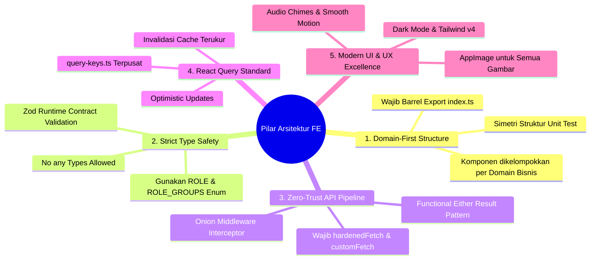

# Frontend Developer Handbook & Coding Best Practices

> **Project**: Kumpul Cafe – Digital QR Code Menu System & Multi-Branch FnB SaaS  
> **Target Audience**: Seluruh Frontend Engineer & Kontributor  
> **Document Location**: `docs/fe/guidelines/frontend-development-handbook.md`  
> **Status**: MANDATORY CODING GUIDELINES  

---

## 🧭 1. Prinsip Utama & Filosofi Arsitektur

Boilerplate ini dirancang dengan standar kualitas tinggi (*production-grade*), tipe-aman (*100% type-safe*), terenkripsi (*Zero-Trust*), dan modular (*Domain-First*). Setiap engineer yang menambahkan atau mengubah fitur **wajib** mematuhi 5 pilar utama berikut:



---

## 🏛️ 2. Aturan Struktur Folder (`src/`)

### A. Lokasi Komponen (`src/components/`)
Komponen **DILARANG** ditumpuk di folder flat atau diikat pada satu nama peran (misal: jangan membuat `src/components/admin/orders-view.tsx`). Kelompokkan berdasarkan **Domain Bisnis**:

```
src/components/
├── orders/          # Komponen Pesanan (Shared: Admin & Kitchen)
├── tables/          # Komponen Meja & Floor Plan (Shared: Admin, Cashier, Waiter)
├── menus/           # Komponen Katalog & Form Menu
├── reports/         # Komponen Laporan & Analitik Penjualan
├── banners/         # Komponen Banner Promo & Carousel
├── common/          # Cross-cutting Guards, Sidebar, Header, Modals
├── ui/              # Primitives Shadcn/Radix (Button, Dialog, Input, AppImage)
└── test/            # Simetris dengan folder domain (test/orders, test/tables, dst.)
```

> **Aturan Wajib**: Setiap folder domain **HARUS** memiliki file `index.ts` (Barrel Export) yang mengekspor seluruh komponen publik di dalamnya.

---

## 🛠️ 3. How-To Recipes (Panduan Praktis Langkah demi Langkah)

---

### 📖 Resep 1: Cara Menambahkan Endpoint API & Validasi Zod Baru

Jangan pernah memanggil `fetch()` atau `axios` secara mentah (*raw*). Selalu gunakan `hardenedFetch` dengan validasi runtime Zod.

#### Langkah 1: Definisikan Schema Zod di `src/lib/validations/<domain>.schema.ts`
```typescript
import { z } from 'zod';

export const StaffProfileSchema = z.object({
  id: z.string().uuid(),
  name: z.string().min(1, 'Nama wajib diisi'),
  email: z.string().email('Format email tidak valid'),
  role: z.enum(['ADMIN', 'CASHIER', 'KITCHEN', 'WAITER']),
  isActive: z.boolean().default(true),
});

export type StaffProfile = z.infer<typeof StaffProfileSchema>;
```

#### Langkah 2: Buat Fetcher di `src/lib/api/<domain>-api.ts`
```typescript
import { hardenedFetch, Either, ApiError } from '@/lib/api';
import { StaffProfile, StaffProfileSchema } from '@/lib/validations/staff.schema';

export async function getStaffProfiles(): Promise<Either<ApiError, StaffProfile[]>> {
  return hardenedFetch('/admin/staff', z.array(StaffProfileSchema));
}
```

#### Langkah 3: Ekspor di `src/lib/api/index.ts`
```typescript
export * from './staff-api';
```

---

### 📖 Resep 2: Cara Membuat React Query Hook & Invalidation Cache

#### Langkah 1: Daftarkan Query Key di `src/lib/query-keys.ts`
```typescript
export const adminQueryKeys = {
  // ...
  staffList: () => ['admin', 'staff', 'list'] as const,
};
```

#### Langkah 2: Buat Hook di `src/hooks/queries/use-admin-staff.ts`
```typescript
import { useQuery, useMutation, useQueryClient } from '@tanstack/react-query';
import { getStaffProfiles, createStaffProfile } from '@/lib/api';
import { adminQueryKeys } from '@/lib/query-keys';
import { notifyApiError } from '@/lib/api';
import { toast } from 'sonner';

export function useAdminStaffQuery() {
  return useQuery({
    queryKey: adminQueryKeys.staffList(),
    queryFn: async () => {
      const result = await getStaffProfiles();
      if (result.isLeft()) throw result.value;
      return result.value;
    },
    staleTime: 60000,
  });
}

export function useCreateStaffMutation() {
  const queryClient = useQueryClient();

  return useMutation({
    mutationFn: async (payload: CreateStaffDto) => {
      const result = await createStaffProfile(payload);
      if (result.isLeft()) throw result.value;
      return result.value;
    },
    onError: (err) => {
      notifyApiError(err);
    },
    onSuccess: (data) => {
      toast.success(`Akun staf ${data.name} berhasil dibuat!`);
      queryClient.invalidateQueries({ queryKey: adminQueryKeys.staffList() });
    },
  });
}
```

---

### 📖 Resep 3: Cara Membuat Halaman Baru Terproteksi Role (`RoleGuard`)

#### Contoh: Halaman Staff di `src/app/(dashboard)/admin/staff/page.tsx`
```tsx
'use client';

import { RoleGuard } from '@/components/common';
import { ROLE } from '@/lib/constants/roles';
import { StaffTable } from '@/components/staff';

export default function AdminStaffPage() {
  return (
    // 1. Selalu bungkus dengan RoleGuard
    <RoleGuard allowedRoles={[ROLE.ADMIN]}>
      <div className="space-y-6">
        <h1 className="text-2xl font-bold text-stone-900 dark:text-zinc-50">
          Manajemen Akun Staf Cabang
        </h1>
        <StaffTable />
      </div>
    </RoleGuard>
  );
}
```

> **Untuk multi-role sharing**: Gunakan konstanta grup seperti `ROLE_GROUPS.KITCHEN_OR_ADMIN` atau `ROLE_GROUPS.CASHIER_OR_ADMIN`.

---

### 📖 Resep 4: Cara Menampilkan Gambar yang Aman & Cepat (`AppImage`)

Jangan gunakan tag `` biasa karena tidak memiliki optimasi format webp, shimmer loading state, dan broken-image placeholder.

```tsx
import { AppImage } from '@/components/ui';

// Contoh Responsive Thumbnail:
<div className="relative w-16 h-16 rounded-2xl overflow-hidden bg-stone-100">
  <AppImage
    src={menu.imageUrl}
    alt={menu.name}
    fill
    sizes="64px"
    className="object-cover"
  />
</div>
```

---

### 📖 Resep 5: Cara Menulis Unit Test (Vitest + Testing Library)

Tempatkan file pengujian di folder `src/components/test/<domain>/<name>.spec.tsx`.

```tsx
import { describe, it, expect, vi, beforeEach } from 'vitest';
import { render, screen, fireEvent } from '@testing-library/react';
import { StaffTable } from '@/components/staff';

describe('StaffTable Component', () => {
  beforeEach(() => {
    vi.clearAllMocks();
  });

  it('renders staff names and role badges properly', () => {
    render(
      <StaffTable
        items={[
          { id: '1', name: 'Budi Santoso', email: 'budi@cafe.com', role: 'CASHIER', isActive: true },
        ]}
      />
    );

    expect(screen.getByText('Budi Santoso')).toBeInTheDocument();
    expect(screen.getByText('budi@cafe.com')).toBeInTheDocument();
  });
});
```

---

## 🚫 4. Anti-Patterns & Standar Penulisan Kode Bersih (*Clean Code*)

### 📊 Tabel Anti-Pattern vs Standar Baku

| ❌ DILARANG KERAS (Anti-Pattern) | ✅ CARA YANG BENAR (Standard Pattern) |
| :--- | :--- |
| **Nested `if-else` / `if` di dalam `if` (*Pyramid of Doom*)**: <br>Kondisi bersarang yang membuat kode bergeser ke kanan dan sulit dibaca. | **Selalu Gunakan Early Return (*Guard Clauses*)**: <br>Keluar lebih awal jika kondisi tidak terpenuhi atau terjadi error. |
| **Nested Loops (`for` di dalam `for`) ($O(N^2)$)**: <br>Looping bertingkat yang memperlambat performa dan sulit ditelusuri. | **Gunakan Lookup `Map`/`Set` atau Deklaratif Methods**: <br>Gunakan `map`, `filter`, `find`, `reduce`, atau indexed lookup $O(1)$. |
| **Super Function / God Function**: <br>Fungsi raksasa (>50 baris) yang mengerjakan banyak hal sekaligus dan susah di-debug. | **Pecah ke Sub-Functions Kecil (*Single Responsibility*)**: <br>Setiap fungsi hanya melakukan 1 tugas spesifik dengan penamaan jelas. |
| **Hardcoding role string manual**:  <br>`allowedRoles={['ADMIN', 'CASHIER']}` | **Gunakan Enum / Konstanta Terpusat**: <br>`allowedRoles={[ROLE.ADMIN, ROLE.CASHIER]}` atau `ROLE_GROUPS.CASHIER_OR_ADMIN` |
| **Memanggil `fetch()` atau `axios` langsung**: <br>`const res = await fetch('/api/menus')` | **Gunakan `hardenedFetch()`**: <br>`hardenedFetch('/admin/menus', MenuSchema)` |
| **Menelan Error tanpa notifikasi**: <br>`catch (err) { console.log(err) }` | **Gunakan `notifyApiError()`**: <br>`if (res.isLeft()) notifyApiError(res.value)` |
| **Tag HTML `` mentah**: <br>`` | **Gunakan `<AppImage />`**: <br>`<AppImage src={url} alt={name} fill />` |
| **Membuat komponen flat di luar domain**: <br>`src/components/admin/my-table.tsx` | **Kelompokkan ke Domain**: <br>`src/components/tables/my-table.tsx` + `index.ts` |
| **Import path relatif berantakan**: <br>`import { Btn } from '../../../components/ui/button'` | **Gunakan Alias Path & Barrel**: <br>`import { Button } from '@/components/ui'` |

---

### 💡 Contoh Praktis Standar Penulisan:

#### A. Wajib Early Return (Hindari *Pyramid of Doom*)
```typescript
// ❌ BURUK: Nested if-else berjenjang
function handleProcessOrder(order: Order | null, user: User | null) {
  if (user) {
    if (user.role === ROLE.CASHIER) {
      if (order) {
        if (order.status === 'PENDING') {
          // Logika baru dijalankan di kedalaman 4 tab indentasi
          return confirmPayment(order);
        } else {
          toast.error('Pesanan bukan pending');
        }
      } else {
        toast.error('Pesanan tidak ditemukan');
      }
    } else {
      toast.error('Akses ditolak');
    }
  } else {
    toast.error('User belum login');
  }
}

// ✅ BENAR: Early return bersih dan linear (Guard Clauses)
function handleProcessOrder(order: Order | null, user: User | null) {
  if (!user) return toast.error('User belum login');
  if (user.role !== ROLE.CASHIER) return toast.error('Akses ditolak');
  if (!order) return toast.error('Pesanan tidak ditemukan');
  if (order.status !== 'PENDING') return toast.error('Pesanan bukan pending');

  // Logika utama langsung dieksekusi di root level tanpa indentasi bertingkat
  return confirmPayment(order);
}
```

#### B. Hindari Nested Loops (`for` dalam `for`)
```typescript
// ❌ BURUK: O(N * M) Nested Loop berulang
function matchOrderItems(orders: Order[], activeItems: Item[]) {
  const result = [];
  for (let i = 0; i < orders.length; i++) {
    for (let j = 0; j < activeItems.length; j++) {
      if (orders[i].itemId === activeItems[j].id) {
        result.push({ order: orders[i], item: activeItems[j] });
      }
    }
  }
  return result;
}

// ✅ BENAR: Gunakan Lookup Map untuk O(N + M) yang cepat & readable
function matchOrderItems(orders: Order[], activeItems: Item[]) {
  const itemMap = new Map(activeItems.map((item) => [item.id, item]));

  return orders
    .filter((order) => itemMap.has(order.itemId))
    .map((order) => ({
      order,
      item: itemMap.get(order.itemId)!,
    }));
}
```

#### C. Hindari "Super Function" (Pecah Berdasarkan Tanggung Jawab)
```typescript
// ❌ BURUK: Super Function 100 baris yang validasi, hitung diskon, format rupiah, dan kirim API sekaligus
async function handleCheckoutSuperFunction(cart: Cart) { /* ...100 baris kode rumit... */ }

// ✅ BENAR: Modular, Teruji, dan Mudah di-Debug
function validateCartItems(items: CartItem[]): boolean { /* ... */ }
function calculateOrderTotals(items: CartItem[], taxRate: number) { /* ... */ }
async function submitOrderPayload(payload: OrderPayload) { /* ... */ }

async function handleCheckout(cart: Cart) {
  if (!validateCartItems(cart.items)) return;
  const totals = calculateOrderTotals(cart.items, 0.1);
  return submitOrderPayload({ items: cart.items, totals });
}
```

---

## 🧪 5. Quality Gate Checklist (Sebelum Commit / Pull Request)

Sebelum membuat commit atau mengajukan PR, setiap engineer wajib menjalankan 2 perintah berikut di terminal:

```bash
# 1. Pastikan 0 Type Error pada TypeScript Compiler
npx tsc --noEmit

# 2. Pastikan seluruh Unit Test Suite (Vitest) 100% Passed Green
npm test -- --run
```

---

## 🔗 6. Dokumen Terkait & Referensi Arsitektur

- 📄 Spesifikasi Arsitektur Frontend: [architecture-design.md](file:///d:/code/fe-menu-scan-latihan/docs/fe/architecture/architecture-design.md)
- 📄 Spesifikasi Interceptor Pipeline: [interceptor-pipeline-architecture.md](file:///d:/code/fe-menu-scan-latihan/docs/fe/architecture/interceptor-pipeline-architecture.md)
- 📄 Blueprint Operasional Cabang Kafe: [cafe-branch-operational-blueprint.md](file:///d:/code/fe-menu-scan-latihan/docs/fe/architecture/cafe-branch-operational-blueprint.md)
- 📄 Milestones & Roadmap Frontend: [implementation-milestones.md](file:///d:/code/fe-menu-scan-latihan/docs/fe/roadmap/implementation-milestones.md)
