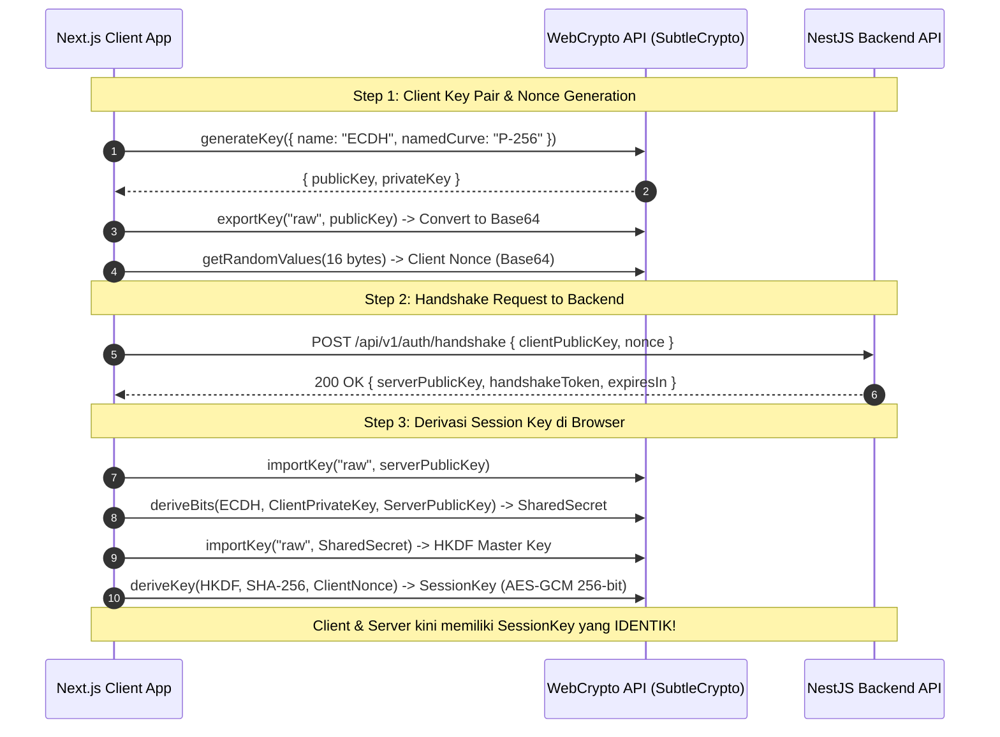

# Client-Side Payload Encryption & ECDH Handshake Strategy (Native `fetch`)

> **Document Status**: Complete Architecture Specification  
> **Scope**: Next.js (Frontend Client Application)  
> **Security Standard**: Application Layer Zero-Trust Encryption via Web Crypto API (P-256 ECDH + AES-256-GCM) + Native `fetch`  
> **Document Location**: `docs/fe/security/client-crypto-strategy.md`  

---

## 🎯 1. Overview & Objective

Untuk menjaga integritas dan kerahasiaan data pada sistem **MenuScan**, aplikasi Next.js menerapkan enkripsi data pada **Application Layer**. Seluruh data sensitif yang dikirim dan diterima dari backend NestJS dibungkus dalam ciphertext **AES-256-GCM**.

Proses pembuatan kunci simetris (*Session Key*) dilakukan di sisi browser menggunakan **Web Crypto API** native (`window.crypto.subtle`) melalui protokol **ECDH Handshake**.

Seluruh request HTTP dieksekusi menggunakan **Native `fetch` Wrapper (`customFetch`)** tanpa membutuhkan library eksternal seperti Axios.

---

## 🔐 2. Spesifikasi Kriptografi Client

| Komponen | Spesifikasi Browser Native | Keterangan |
| :--- | :--- | :--- |
| **Crypto Engine** | `window.crypto.subtle` | Native browser API (sangat cepat & aman). |
| **Key Exchange Protocol** | **ECDH (`P-256` / `prime256v1`)** | Menghasilkan Public/Private Keypair 256-bit di browser. |
| **Key Derivation Function** | **HKDF (SHA-256)** | Derivasi Shared Secret + Client Nonce menjadi 256-bit AES-GCM Key. |
| **Symmetric Cipher** | **AES-256-GCM** | Ciphertext terotentikasi dengan IV 12-byte & Tag 16-byte. |
| **HTTP Engine** | Native `fetch` | Ringan, modern, tanpa overhead Axios. |
| **Session Lifetime** | **2 Jam** | Otomatis melakukan *auto-rehandshake* jika token kadaluarsa. |

---

## 🤝 3. Detail Implementasi ECDH Handshake di Browser



---

## 🔄 4. Implementasi Native `customFetch` Wrapper

Seluruh komunikasi API dibungkus oleh fungsi **`customFetch`** (`lib/api/custom-fetch.ts`).

```typescript
// Blueprint Konseptual Native customFetch Wrapper Function
export interface CustomFetchOptions extends RequestInit {
  skipEncryption?: boolean;
}

export async function customFetch<T = any>(
  endpoint: string,
  options: CustomFetchOptions = {}
): Promise<T> {
  const { skipEncryption = false, headers = {}, body, ...restOptions } = options;

  // 1. Pastikan Handshake Token & SessionKey tersedia di RAM
  const { handshakeToken, sessionKey } = await ensureHandshakeSession();

  const reqHeaders: Record<string, string> = {
    'Content-Type': 'application/json',
    'x-handshake-token': handshakeToken,
    ...(headers as Record<string, string>),
  };

  let reqBody = body;

  // 2. Enkripsi Request Body jika ada data JSON dan tidak skipEncryption
  if (body && !skipEncryption && typeof body === 'string') {
    const iv = window.crypto.getRandomValues(new Uint8Array(12));
    const encryptedBuffer = await window.crypto.subtle.encrypt(
      { name: 'AES-GCM', iv, tagLength: 128 },
      sessionKey,
      new TextEncoder().encode(body)
    );

    const ciphertext = encryptedBuffer.slice(0, encryptedBuffer.byteLength - 16);
    const tag = encryptedBuffer.slice(encryptedBuffer.byteLength - 16);

    reqBody = JSON.stringify({
      encrypted: true,
      iv: bufferToBase64(iv),
      tag: bufferToBase64(tag),
      payload: bufferToBase64(ciphertext),
    });
  }

  // 3. Eksekusi Native fetch()
  const response = await fetch(`${process.env.NEXT_PUBLIC_API_BASE_URL}${endpoint}`, {
    ...restOptions,
    headers: reqHeaders,
    body: reqBody,
  });

  // 4. Tangani Status 401 HANDSHAKE_EXPIRED -> Silent Re-Handshake & Auto Retry
  if (response.status === 401) {
    const clonedRes = response.clone();
    const errData = await clonedRes.json().catch(() => ({}));
    if (errData?.errorCode === 'HANDSHAKE_EXPIRED') {
      await performHandshake(); // Handshake ulang
      return customFetch<T>(endpoint, options); // Retry request
    }
  }

  const json = await response.json();

  // 5. Dekripsi Response Payload jika terenkripsi
  if (json && json.encrypted && json.payload) {
    const iv = base64ToBuffer(json.iv);
    const tag = base64ToBuffer(json.tag);
    const ciphertext = base64ToBuffer(json.payload);
    const combinedBuffer = concatBuffers(ciphertext, tag);

    const decryptedBuffer = await window.crypto.subtle.decrypt(
      { name: 'AES-GCM', iv, tagLength: 128 },
      sessionKey,
      combinedBuffer
    );

    return JSON.parse(new TextDecoder().decode(decryptedBuffer));
  }

  return json;
}
```

---

## 🔒 5. Keamanan Session Key di Client Side

1. **Memory-Only Storage**: `SessionKey` (CryptoKey object) disimpan dalam **RAM / Closures State** (via Zustand store `useHandshakeStore`), **bukan** di `localStorage` atau `sessionStorage` dalam bentuk plaintext string agar tidak mudah diintip skrip XSS.
2. **Strict Expiry**: Jika aplikasi ditinggalkan selama > 2 jam, sesi dianggap kadaluarsa dan otomatis memicu handshake baru saat user berinteraksi kembali.

---

## 🔗 6. Terhubung ke Dokumen Terkait

- 📄 Arsitektur Utama Frontend: [architecture-design.md](file:///d:/code/fe-menu-scan-latihan/docs/fe/architecture/architecture-design.md)
- 📄 Wireframe & UI/UX Design: [ui-wireframe-design.md](file:///d:/code/fe-menu-scan-latihan/docs/fe/wireframe/ui-wireframe-design.md)
